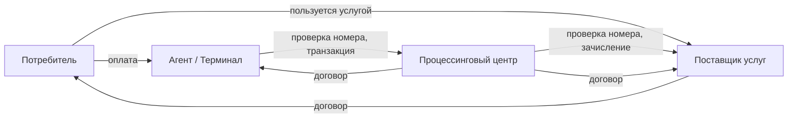

# Практическое задание: распределённая система оплаты услуг

Большое сквозное практическое задание, охватывающее всю курсовую программу: ООП, работу с файлами и БД, HTTP-клиент и HTTP-сервер, GUI, логирование, тестирование.

## Постановка задачи

Спроектировать и реализовать **распределённую систему оплаты услуг** из четырёх независимых ролей:

- **Потребитель** услуг — физическое лицо.
- **Поставщик** услуг — провайдер (мобильный оператор, интернет-провайдер и т.п.).
- **Процессинговый центр** — посредник, агрегирующий платежи (Киберплат, ОСМП-подобная роль).
- **Агент** — терминал оплаты, через который потребитель платит.

Потоки взаимодействия:



## Общие требования

- Реализация — на **Python** или **Go** (можно смешанные сервисы — например, бэкенд на Go, клиент на Python).
- Для всех сервисов обязательно: **логирование** (см. [Тема 11](../topics/11-application-development/lecture-01-logging.md)), **тестирование** (см. [Тема 12](../topics/12-code-quality-and-testing/lecture-01-testing.md)) и **документирование**.
- Визуальный интерфейс — Tkinter, PyQt6/PySide6 или web-обёртка (pywebview / Wails), на выбор (см. [Тема 8](../topics/08-app-development-stages/index.md)).
- Хранение данных — JSON, SQLite или другая встроенная БД (см. [Тема 10, Лекция 3](../topics/10-standard-modules/lecture-03-sqlite.md)).
- HTTP — `requests`/`httpx` в Python, `net/http` в Go (см. [Тема 10, Лекция 1](../topics/10-standard-modules/lecture-01-http.md)).
- Авторизация — Basic Auth для всех запросов.

## Роли и их функции

### Потребитель (Consumer)

- Заключает договоры с произвольным количеством **поставщиков** (получает уникальный идентификатор: номер телефона или номер договора, URL для получения услуги, описание протокола взаимодействия).
- **Визуальный интерфейс**:
    - управление списком договоров (добавление / редактирование / удаление);
    - эмуляция пользования услугами: кнопки «позвонить», «выйти в интернет» и т. п. в зависимости от выбранного поставщика;
    - для эмуляции пользования услугой соответствующему поставщику отправляется `POST`-запрос (параметры определяются в договоре).
- **Хранение данных** о договорах — JSON-файл.

### Поставщик (Provider)

- Предоставляет **визуальный интерфейс** для заключения договора с потребителем: получает ФИО, паспорт, email; выдаёт уникальный идентификатор (телефон/договор), URL и описание протокола обмена.
- **Хранение данных** о клиентах — в БД (SQLite).
- Заключает договоры на оплату услуг с произвольным количеством **процессинговых центров**: предоставляет URL своего HTTP-сервера, логин/пароль для авторизации, поля для заполнения при оплате (с регулярными выражениями для валидации).
- **HTTP-сервер**:
    - эндпоинт для приёма транзакций оплаты (все транзакции логируются и сохраняются в БД);
    - эндпоинт для проверки наличия номера/договора (вызывается процессинговым центром).
- **Дополнительно:** формирование отчёта по оказанным услугам в Excel/CSV и отправка на электронную почту потребителя.

### Процессинговый центр (Processing)

- **Визуальный интерфейс** для:
    - заключения договоров с поставщиками (получить URL, логин/пароль, протокол обмена, поля с regex-валидацией);
    - заключения договоров с агентами (выдать уникальный номер договора, логин/пароль, протокол обмена, задать комиссию процессинга, пополнить баланс агента).
- **Хранение данных** о поставщиках, агентах и транзакциях — в БД.
- **HTTP-сервер** для приёма запросов от агентов.
- **POST-запросы** поставщикам:
    - проксирование запросов проверки номера;
    - зачисление баланса (в транзакции).
- **Дополнительно:** отчёты в Excel/CSV — итоговые и потранзакционные, для поставщиков и агентов.

### Агент (Agent / Терминал)

- Заключение договора с процессингом (получение URL, логина/пароля, протокола).
- **Визуальный интерфейс** (на pywebview / CEF Python / Wails — web-обёртка, см. [Тема 8, Лекция 3](../topics/08-app-development-stages/lecture-03-web-ui.md)) для эмуляции оплаты потребителем.
- **POST-запросы** процессингу:
    - получение списка поставщиков с реквизитами для оплаты (раз в 30 минут);
    - получение баланса агента раз в 5 минут (при нулевом — блокировать работу терминала);
    - проверка номера перед оплатой;
    - транзакция после оплаты (номер, сумма, с учётом комиссии агента).
- **Хранение данных** о транзакциях — в БД.
- **Дополнительно:** подключить реальный купюроприёмник CashCode CCNET (реализовать протокол обмена по COM-порту и события приёма денег).

## Подготовка окружения

1. Установите Python (3.13+) и/или Go (1.23+).
2. Установите [VS Code](../topics/07-ide-vscode/lecture-01-setup.md) с расширениями Python (Pylance + Ruff + debugpy) и Go (gopls + dlv).
3. Создайте каталог для проекта.
4. Откройте каталог в VS Code, инициализируйте `pyproject.toml` через `uv init` (для Python) или `go mod init example.com/payment-system` (для Go).
5. Спроектируйте структуру каталогов под четыре сервиса:

    ```text
    payment-system/
    ├── consumer/
    ├── provider/
    ├── processing/
    ├── agent/
    └── shared/          # общие модели, утилиты
    ```

## Подсказка: динамическое создание класса (Python)

При реализации процессинга часто возникает задача работы с поставщиками: список поставщиков динамический, заранее имена классов неизвестны.

Структура:

```text
providers/
    __init__.py
    beeline.py
    mts.py
```

В `__init__.py`:

```python
from providers.beeline import Beeline
from providers.mts import Mts
# для каждого отлаженного поставщика добавляется импорт
```

В основном модуле:

```python
from providers import *

if __name__ == "__main__":
    # имя класса берём из БД или конфига (в виде строки)
    provider_name = "Beeline"
    # globals() — словарь объектов в текущем пространстве имён
    provider = globals()[provider_name]()
    provider.check_phone("+7900...")
```

Более чистая альтернатива — **реестр** поставщиков:

```python
# providers/registry.py
from typing import Protocol

class Provider(Protocol):
    def check_phone(self, phone: str) -> bool: ...
    def pay(self, phone: str, amount: float) -> bool: ...

_REGISTRY: dict[str, type[Provider]] = {}


def register(name: str):
    def decorator(cls: type[Provider]) -> type[Provider]:
        _REGISTRY[name] = cls
        return cls
    return decorator


def get(name: str) -> Provider:
    return _REGISTRY[name]()


# providers/beeline.py
from providers.registry import register


@register("beeline")
class Beeline:
    def check_phone(self, phone: str) -> bool:
        ...
    def pay(self, phone: str, amount: float) -> bool:
        ...
```

В Go подобную регистрацию делают через `init()`-функции в каждом пакете-провайдере + общий реестр.

## Подсказка: установка Qt Designer

Если выбираете PyQt6 и Qt Designer:

```bash
uv add pyqt6
uv add pyqt6-tools
```

Designer запускается командой `pyqt6-tools designer` (см. [Тема 8, Лекция 2](../topics/08-app-development-stages/lecture-02-pyqt.md)).

Если выбираете PySide6 — designer входит в основной пакет, без дополнительных установок:

```bash
uv add pyside6
pyside6-designer
```

## Критерии приёмки

- ✅ Все четыре сервиса запускаются и взаимодействуют между собой.
- ✅ Каждый сервис имеет логирование (с разными уровнями — `INFO`, `WARNING`, `ERROR`).
- ✅ Каждый сервис имеет автоматические тесты (Pytest или `go test`); покрытие основной логики ≥ 70%.
- ✅ Используется кооперативная многозадачность для периодических задач агента (раз в 30 мин, раз в 5 мин).
- ✅ HTTP-запросы с Basic Auth и обработкой ошибок (retry для временных сбоев, см. [Тема 7, Лекция 3](../topics/07-ide-vscode/lecture-03-errors-decorators.md)).
- ✅ Хранение данных в БД с транзакциями (зачисление баланса должно быть атомарным).
- ✅ Документация: README.md с инструкцией по запуску, диаграмма архитектуры.

## Дополнительные баллы

- Контейнеризация: `Dockerfile` + `docker-compose.yml` для запуска всех четырёх сервисов одной командой.
- CI на GitHub Actions: автоматический прогон тестов и линтера на каждый push.
- Метрики (Prometheus) и health-чеки.
- Web-интерфейс для административной панели процессинга на FastAPI / Gin / Echo.
- Подключение реального купюроприёмника CashCode CCNET через COM-порт.
