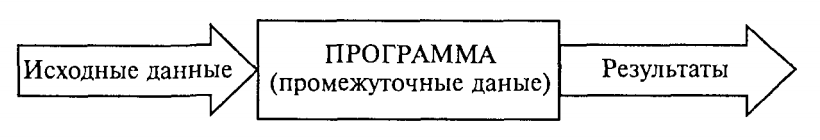
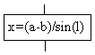
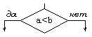
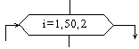
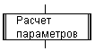
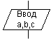
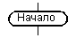
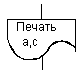
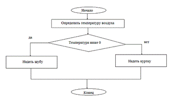

# Лекция 1. Основные понятия алгоритмизации (Algorithm Basics)

Работа по решению любой задачи с использованием компьютера делится на следующие этапы:

1. Постановка задачи.
2. Формализация задачи.
3. Построение алгоритма.
4. Составление программы на языке программирования.
5. Отладка и тестирование программы.
6. Использование программы.

Часто эту последовательность называют технологической цепочкой решения задачи. Непосредственно к программированию относятся пункты 3, 4, 5.

На этапе **постановки задачи** должно быть чётко сформулировано, что дано и что требуется найти. Здесь очень важно определить полный набор исходных данных, необходимых для получения решения.

На этапе **формализации** задача чаще всего переводится на язык математических формул, уравнений, отношений. Если решение требует математического описания реального объекта, явления или процесса, то формализация равносильна получению соответствующей математической модели.

На этапе **построения алгоритма** опытные программисты часто сразу пишут программы на языках программирования, не прибегая к специальным способам описания алгоритмов (блок-схемам, псевдокодам). Однако в учебных целях полезно использовать эти средства, а затем переводить полученный алгоритм на язык программирования.

Первые три этапа предусматривают работу без компьютера. Дальше следует собственно программирование в определённой системе программирования. Последний (шестой) этап — использование уже разработанной программы в практических целях.

Таким образом, программист должен обладать следующими знаниями и навыками:

- уметь строить алгоритмы;
- знать языки программирования;
- уметь работать в соответствующей системе программирования.

## Понятие алгоритма

Одним из фундаментальных понятий в информатике является понятие алгоритма. Происхождение самого термина «алгоритм» связано с математикой. Это слово происходит от *Algorithmi* — латинского написания имени Мухаммеда аль-Хорезми (787–850), выдающегося математика средневекового Востока. В XII в. был выполнен латинский перевод его математического трактата, из которого европейцы узнали о десятичной позиционной системе счисления и правилах арифметики многозначных чисел. Именно эти правила в то время называли алгоритмами. Сложение, вычитание, умножение столбиком, деление уголком многозначных чисел — вот первые алгоритмы в математике.

В наше время понятие алгоритма трактуется шире.

> **Алгоритм** — это последовательность команд управления каким-либо исполнителем.

Алгоритм может быть предназначен для выполнения его человеком или автоматическим устройством — *формальным исполнителем*. Задача исполнителя — точная реализация уже имеющегося алгоритма. Формальный исполнитель не обязан вникать в сущность алгоритма, а возможно, и неспособен его понять.

Примером формального исполнителя может служить автоматическая стиральная машина, которая неукоснительно исполняет предписанные ей действия, даже если вы забыли положить в неё порошок. Человек тоже может выступать в роли формального исполнителя, но в первую очередь формальными исполнителями являются различные автоматические устройства, и компьютер в том числе.

В разделе информатики «Программирование» изучаются методы программного управления работой ЭВМ. Следовательно, в качестве исполнителя выступает компьютер.

Компьютер работает с величинами — различными информационными объектами: числами, символами, кодами и т. п. Поэтому алгоритмы, предназначенные для управления компьютером, принято называть *алгоритмами работы с величинами*.

**Данные и величины.** Совокупность величин, с которыми работает компьютер, принято называть данными. По отношению к программе данные делятся на исходные, результаты (окончательные данные) и промежуточные, которые получаются в процессе вычислений.



Например, при решении квадратного уравнения a·x² + b·x + c = 0 исходными данными являются коэффициенты `a`, `b`, `c`; результатами — корни уравнения x₁, x₂; промежуточным данным — дискриминант уравнения D = b² − 4ac.

Для успешного освоения программирования необходимо усвоить следующее правило: *всякая величина занимает своё определённое место в памяти ЭВМ* (иногда говорят — ячейку памяти). Хотя термин «ячейка» с точки зрения архитектуры современных ЭВМ несколько устарел, в учебных целях его удобно использовать.

У всякой величины имеются три основных свойства: *имя, значение и тип* (на самом деле многие современные языки, такие как Python или JavaScript, обходятся без явного указания типа, интерпретируя его в зависимости от контекста). На уровне команд процессора величина идентифицируется при помощи адреса ячейки памяти, в которой она хранится. В алгоритмах и языках программирования величины делятся на *константы и переменные*. Константа — неизменная величина, представляется собственным значением, например: `15`, `34.7`, `"k"`, `True`. Переменные величины могут изменять свои значения в ходе выполнения программы и представляются символическими именами — идентификаторами, например: `X`, `S2`, `cod15`. Любая константа, как и переменная, занимает ячейку памяти, а значение этих величин определяется двоичным кодом в этой ячейке.

Теперь о типах величин — *типах данных*. С понятием типа данных вы уже встречались, изучая базы данных и электронные таблицы. Это понятие является фундаментальным для программирования.

В каждом языке программирования существует своя концепция типов данных, своя система типов. Тем не менее в любой язык входит минимально необходимый набор основных типов данных: *целый*, *вещественный*, *логический* и *символьный*. С типом величины связаны три её характеристики: множество допустимых значений, множество допустимых операций, форма внутреннего представления.

| Тип          | Значения                                                                 | Операции                                                                | Внутреннее представление                                                |
|--------------|--------------------------------------------------------------------------|-------------------------------------------------------------------------|-------------------------------------------------------------------------|
| Целый        | Целые положительные и отрицательные числа в некотором диапазоне.<br>Примеры: 23, −12, 387 | Арифметические операции: `+`, `−`, `*`, целое деление и остаток.<br>Операции отношений (`<`, `>`, `==` и др.) | Формат с фиксированной точкой                                            |
| Вещественный | Любые (целые и дробные) числа в некотором диапазоне.<br>Примеры: 2.5, −0.01, 3.6e-9 | Арифметические операции: `+`, `−`, `*`, `/`.<br>Операции отношений     | Формат с плавающей точкой                                                |
| Логический   | `True`, `False`                                                          | Логические операции: И (`and`/`&&`), ИЛИ (`or`/`\|\|`), НЕ (`not`/`!`). Операции отношений | 1 бит: 1 — true; 0 — false                                          |
| Символьный   | Любые символы компьютерного алфавита.<br>Примеры: `'а'`, `'5'`, `'+'`, `'$'`   | Операции отношений                                                       | Коды таблицы символьной кодировки. Современные кодировки: UTF-8, UTF-16  |

Типы констант определяются по контексту (по форме записи в тексте), а типы переменных устанавливаются в описаниях переменных. В одних языках типизация явная (Go, Java, C), в других — динамическая, тип переменной определяется при первом присваивании (Python, JavaScript).

Есть ещё один вариант классификации данных — *по структуре*. Данные делятся на *простые и структурированные*. Для простых величин (их также называют скалярными) справедливо: одна величина — одно значение, для структурированных: одна величина — множество значений. К структурированным относятся массивы, строки, множества и т. д.

## Свойства алгоритма

- **Массовость** — алгоритм решения задачи разрабатывается в общем виде, то есть он должен быть применим для некоторого класса задач, различающихся только исходными данными. Исходные данные могут выбираться из некоторой области, которая называется *областью применимости алгоритма*.
- **Понятность** — команды, используемые в алгоритме, должны быть понятны исполнителю.
- **Дискретность** (прерывность, раздельность) — алгоритм представляет процесс решения задачи как последовательное выполнение простых шагов. Каждое действие исполняется только после того, как закончилось исполнение предыдущего.
- **Определённость** (детерминированность) — однозначный результат при заданных исходных данных. Благодаря этому свойству процесс выполнения алгоритма носит механический характер.
- **Результативность** (конечность) — алгоритм должен приводить к решению задачи за конечное число шагов.

## Формы записи алгоритмов

На практике распространены следующие формы представления алгоритмов:

- **словесная** — запись на естественном языке;
- **графическая** — изображения из графических символов;
- **псевдокод** — полуформализованное описание на условном алгоритмическом языке, включающее элементы языка программирования, фразы естественного языка и общепринятые математические обозначения;
- **программная** — текст на языке программирования.

**Пример:** написать алгоритм «Одеться по погоде». Если на улице температура ниже 0, надеть шубу, иначе — куртку.

### Словесный способ

Алгоритм задаётся в произвольном изложении на естественном языке.

```
Алгоритм ПОГОДА
Начало
  определить температуру воздуха
  если температура ниже 0, то надеть шубу, иначе надеть куртку
Конец.
```

Словесный способ не имеет широкого распространения, так как такие описания строго не формализуемы, страдают многословностью и допускают неоднозначность толкования.

### Графический способ (блок-схемы)

Наибольшее распространение благодаря наглядности получил графический способ записи алгоритмов. При графическом представлении алгоритм изображается в виде последовательности связанных между собой функциональных блоков, каждый из которых соответствует выполнению одного или нескольких действий.

В блок-схеме каждому типу действий (вводу исходных данных, вычислению значений выражений, проверке условий, управлению повторением действий, окончанию обработки и т. п.) соответствует геометрическая фигура. Блочные символы соединяются линиями переходов, определяющими очередность выполнения действий.

| Название символа         | Обозначение                                                | Пояснение                                                  |
|--------------------------|------------------------------------------------------------|------------------------------------------------------------|
| Процесс                  |    | Вычислительное действие или последовательность действий    |
| Решение                  |    | Проверка условий                                           |
| Модификация              |  | Начало цикла                                              |
| Предопределённый процесс |  | Вычисления по подпрограмме                              |
| Ввод-вывод               |  | Ввод-вывод в общем виде                                   |
| Пуск-останов             |  | Начало, конец, вход и выход в подпрограмму              |
| Документ                 |   | Вывод результатов на печать                                |

Блок «процесс» применяется для обозначения действия или последовательности действий, изменяющих значение, форму представления или размещения данных. Для наглядности схемы несколько отдельных блоков обработки можно объединять в один.

Блок «решение» используется для обозначения переходов управления по условию. В каждом таком блоке должны быть указаны вопрос, условие или сравнение, которые он определяет.

Блок «модификация» используется для организации циклических конструкций. Внутри блока записывается параметр цикла, для которого указываются его начальное значение, граничное условие и шаг изменения значения параметра.

Блок «предопределённый процесс» используется для обращений к вспомогательным алгоритмам и библиотечным подпрограммам.

Блок «ввод-вывод» используется для преобразования данных в форму, пригодную для обработки (ввод) или отображения результатов (вывод).

Блок «пуск-останов» используется для обозначения начала, конца или прерывания процесса обработки данных.

Блок «документ» предназначен для ввода-вывода данных, носителем которых служит бумага.



### Псевдокод

Псевдокод представляет собой систему обозначений и правил, предназначенную для единообразной записи алгоритмов.

Псевдокод занимает промежуточное место между естественным и формальным языками. С одной стороны, он близок к обычному естественному языку, поэтому алгоритмы могут на нём записываться и читаться как обычный текст. С другой стороны, в псевдокоде используются некоторые формальные конструкции и математическая символика, что приближает запись алгоритма к общепринятой математической записи.

В псевдокоде не приняты строгие синтаксические правила для записи команд, что облегчает запись алгоритма на стадии проектирования и позволяет использовать более широкий набор команд, рассчитанный на абстрактного исполнителя.

Пример псевдокода для задачи «Одеться по погоде»:

```text
ввод t
если t < 0:
    вывести «надеть шубу»
иначе:
    вывести «надеть куртку»
```

### Программный способ

При записи алгоритма в словесной форме, блок-схеме или на псевдокоде допускается определённый произвол. Такая запись точна настолько, чтобы человек понял суть и исполнил алгоритм. Однако компьютер требует точной записи команд без неоднозначностей. Поэтому язык для записи алгоритмов должен быть формализован — это и есть язык программирования.

=== "Python"

    ```python
    t = int(input('Введите температуру воздуха t='))
    if t < 0:
        print('надеть шубу')
    else:
        print('надеть куртку')
    ```

=== "Go"

    ```go
    package main

    import (
        "bufio"
        "fmt"
        "os"
        "strconv"
        "strings"
    )

    func main() {
        fmt.Print("Введите температуру воздуха t=")
        reader := bufio.NewReader(os.Stdin)
        line, _ := reader.ReadString('\n')
        t, _ := strconv.Atoi(strings.TrimSpace(line))

        if t < 0 {
            fmt.Println("надеть шубу")
        } else {
            fmt.Println("надеть куртку")
        }
    }
    ```

## Структурное программирование

Запись алгоритмов решения сложных задач в любой форме, в том числе в виде блок-схемы, может быть слишком объёмной. Поэтому на практике используют методы, облегчающие построение и реализацию алгоритмов.

Один из наиболее распространённых — *метод структурного программирования*, или конструирование алгоритмов методом последовательной детализации. При пошаговой детализации алгоритмы записываются в виде множества вспомогательных алгоритмов, решающих вспомогательные подзадачи, а каждая из них требует получения определённых промежуточных результатов.

Разработав основной алгоритм, можно приступить к разработке алгоритмов «второго уровня», которые, в свою очередь, могут требовать дальнейшей детализации. Процесс детализации продолжается до тех пор, пока не будут написаны все нужные вспомогательные алгоритмы.

Для реализации вспомогательных алгоритмов служат подпрограммы (процедуры, функции). **Подпрограмма** — часть алгоритма, оформленная в виде, допускающем многократное обращение к ней из разных точек программы.

## Общие принципы построения алгоритмов

При разработке алгоритма используют следующие основные принципы:

- **Принцип поэтапной детализации** (другое название — «проектирование сверху вниз»). Этот принцип предполагает первоначальную разработку алгоритма в виде укрупнённых блоков (разбиение задачи на подзадачи) и их постепенную детализацию.
- **Принцип «от главного к второстепенному»** — составление алгоритма, начиная с главной конструкции. При этом часто приходится «достраивать» алгоритм в обратную сторону, например от середины к началу.
- **Принцип структурирования** — использование только типовых алгоритмических структур при построении алгоритма. Нетиповой структурой считается, например, циклическая конструкция с дополнительными выходами из тела цикла. В программировании нетиповые структуры появляются в результате злоупотребления командой безусловного перехода (`goto`). При этом программа хуже читается и труднее отлаживается.

## Определение сложности алгоритмов

Существует несколько способов измерения сложности алгоритма. Программисты обычно сосредотачивают внимание на скорости алгоритма, но не менее важны и другие показатели — требования к объёму памяти, свободному месту на диске. Использование быстрого алгоритма не приведёт к ожидаемым результатам, если для его работы понадобится больше памяти, чем есть у компьютера.

### Память или время

Многие алгоритмы предлагают выбор между объёмом памяти и скоростью. Задачу можно решить быстро, используя большой объём памяти, или медленнее — занимая меньший объём.

Типичный пример — алгоритм поиска кратчайшего пути. Представив карту города в виде сети, можно написать алгоритм для определения кратчайшего расстояния между двумя точками. Чтобы не вычислять эти расстояния каждый раз, можно вывести кратчайшие расстояния между всеми точками и сохранить результаты в таблице. Карта большого города может содержать десятки тысяч точек — тогда таблица должна содержать более 10 млрд ячеек. То есть для ускорения работы алгоритма потребуется десятки гигабайт памяти.

Из этой зависимости возникает идея *объёмно-временной сложности*. При таком подходе алгоритм оценивается как с точки зрения скорости выполнения, так и с точки зрения потреблённой памяти.

### Оценка порядка

При сравнении алгоритмов важно знать, как их сложность зависит от объёма входных данных. Допустим, при сортировке одним методом обработка тысячи чисел занимает 1 c., а миллиона — 10 c.; при использовании другого алгоритма — 2 c. и 5 c. соответственно. В таких условиях нельзя однозначно сказать, какой алгоритм лучше.

В общем случае сложность алгоритма оценивают *по порядку величины*. Алгоритм имеет сложность `O(f(n))`, если при увеличении размерности входных данных N время выполнения алгоритма возрастает с той же скоростью, что и функция `f(N)`. Рассмотрим код, который для матрицы `A[N×N]` находит максимальный элемент в каждой строке:

=== "Python"

    ```python
    for i in range(N):
        maximum = A[i][0]
        for j in range(N):
            if A[i][j] > maximum:
                maximum = A[i][j]
        print(maximum)
    ```

=== "Go"

    ```go
    for i := 0; i < N; i++ {
        maximum := A[i][0]
        for j := 0; j < N; j++ {
            if A[i][j] > maximum {
                maximum = A[i][j]
            }
        }
        fmt.Println(maximum)
    }
    ```

В этом алгоритме переменная `i` меняется от 0 до N. При каждом изменении `i` переменная `j` тоже меняется от 0 до N. Во время каждой из N итераций внешнего цикла внутренний цикл выполняется N раз. Общее количество итераций — N·N, сложность — `O(N²)`.

При оценке порядка сложности используют только ту часть выражения, которая возрастает быстрее всего. Например, если рабочий цикл описывается выражением N³+N, сложность — `O(N³)`. Постоянные множители также не учитываются: 3N³ — это `O(N³)`.

### Определение сложности

Наиболее сложными частями программы обычно являются циклы и вызов процедур. В предыдущем примере весь алгоритм выполнен с помощью двух циклов.

Если одна процедура вызывает другую, оценить сложность нужно тщательно. Если в процедуре выполняется фиксированное число инструкций (например, вывод на печать), это практически не влияет на оценку. Если же в вызываемой процедуре выполняется `O(N)` шагов, функция может значительно усложнить алгоритм.

Рассмотрим две процедуры: `slow` со сложностью `O(N³)` и `fast` со сложностью `O(N²)`:

=== "Python"

    ```python
    def slow():
        for i in range(N):
            for j in range(N):
                for k in range(N):
                    pass  # какое-то действие

    def fast():
        for i in range(N):
            for j in range(N):
                slow()

    def both():
        fast()
    ```

=== "Go"

    ```go
    func slow() {
        for i := 0; i < N; i++ {
            for j := 0; j < N; j++ {
                for k := 0; k < N; k++ {
                    _ = k // какое-то действие
                }
            }
        }
    }

    func fast() {
        for i := 0; i < N; i++ {
            for j := 0; j < N; j++ {
                slow()
            }
        }
    }
    ```

Если во внутренних циклах `fast` происходит вызов `slow`, то сложности перемножаются: `O(N²)·O(N³) = O(N⁵)`.

Если же основная программа вызывает процедуры по очереди — сложности складываются: `O(N²) + O(N³) = O(N³)`.

### Сложность рекурсивных алгоритмов

#### Простая рекурсия

Рекурсивные процедуры — процедуры, которые вызывают сами себя. Их сложность зависит не только от внутренних циклов, но и от количества итераций рекурсии. Рассмотрим рекурсивное вычисление факториала:

=== "Python"

    ```python
    def factorial(n: int) -> int:
        if n > 1:
            return n * factorial(n - 1)
        return 1
    ```

=== "Go"

    ```go
    func factorial(n int) int {
        if n > 1 {
            return n * factorial(n-1)
        }
        return 1
    }
    ```

Эта процедура выполняется N раз, вычислительная сложность — `O(N)`.

#### Многократная рекурсия

Рекурсивный алгоритм, который вызывает себя несколько раз, называется *многократной рекурсией*. Такие процедуры сложнее анализировать.

=== "Python"

    ```python
    def double_recursive(n: int) -> None:
        if n > 0:
            double_recursive(n - 1)
            double_recursive(n - 1)
    ```

=== "Go"

    ```go
    func doubleRecursive(n int) {
        if n > 0 {
            doubleRecursive(n - 1)
            doubleRecursive(n - 1)
        }
    }
    ```

Поскольку процедура вызывается дважды, можно было бы предположить `O(2N) = O(N)`. Но на самом деле сложность равна `O(2^(N+1) − 1) = O(2^N)`. Анализ сложности рекурсивных алгоритмов — нетривиальная задача.

#### Объёмная сложность рекурсивных алгоритмов

При каждом вызове процедура запрашивает небольшой объём памяти, но этот объём может значительно увеличиваться в процессе рекурсивных вызовов. По этой причине всегда необходимо проводить хотя бы поверхностный анализ объёмной сложности рекурсивных процедур.

### Средний и наихудший случай

Оценка сложности до порядка — *верхняя граница*. Если программа имеет большой порядок сложности, это не означает, что алгоритм будет выполняться действительно долго. На некоторых наборах данных выполнение занимает меньше времени.

=== "Python"

    ```python
    def locate(A: list[int], data: int) -> int:
        for i, v in enumerate(A):
            if v == data:
                return i
        return -1
    ```

=== "Go"

    ```go
    func locate(A []int, data int) int {
        for i, v := range A {
            if v == data {
                return i
            }
        }
        return -1
    }
    ```

- **Наихудший случай:** искомый элемент в конце списка — N шагов, `O(N)`.
- **Наилучший случай:** элемент в начале — 1 шаг, `O(1)`.
- **Ожидаемый (средний):** при случайном расположении в среднем N/2 сравнений — `O(N)`.

Для многих алгоритмов наихудший случай сильно отличается от ожидаемого. Алгоритм быстрой сортировки в наихудшем случае имеет сложность `O(N²)`, но ожидаемое поведение — `O(N·log N)`, что много быстрее.

### Общие функции оценки сложности

Перечислим функции, чаще всего используемые для оценки сложности, *в порядке возрастания*:

1. `C` — константа (не зависит от входных данных).
2. `log(log N)`.
3. `log N` — поиск в отсортированном массиве (двоичный поиск).
4. `N^C`, где `0 < C < 1`.
5. `N` — линейная сложность (поиск в неотсортированном массиве).
6. `N·log N` — эффективные сортировки.
7. `N^C`, где `C > 1` — полиномиальная сложность.
8. `C^N`, где `C > 1` — экспоненциальная сложность.
9. `N!` — факториальная сложность.

Если уравнение сложности содержит несколько таких функций, его можно сократить до функции, расположенной ниже в этом списке. Например, `O(log N + N!) = O(N!)`.

Обычно алгоритмы со сложностью `N·log N` работают с хорошей скоростью. Алгоритмы со сложностью `N^C` применимы только при небольших значениях `C`. Сложность `C^N` и `N!` очень велика — такие алгоритмы могут использоваться только для обработки небольшого объёма данных.

В заключение — таблица, показывающая, как долго компьютер, осуществляющий миллион операций в секунду, будет выполнять некоторые медленные алгоритмы:

| Сложность | N=10    | N=20         | N=30          | N=40            | N=50            |
|:---------:|:-------:|:------------:|:-------------:|:---------------:|:---------------:|
| N³        | 0.001 с | 0.008 с      | 0.027 с       | 0.064 с         | 0.125 с         |
| 2ᴺ        | 0.001 с | 1.05 с       | 17.9 мин      | 1.29 дней       | 35.7 лет        |
| 3ᴺ        | 0.059 с | 58.1 мин     | 6.53 лет      | 3.86·10⁵ лет    | 2.28·10¹⁰ лет   |
| N!        | 3.63 с  | 7.71·10⁴ лет | 8.41·10¹⁸ лет | 2.59·10³⁴ лет   | 9.64·10⁵⁰ лет   |

Дополнительно: [Википедия: Временна́я сложность алгоритма](https://ru.wikipedia.org/wiki/Временная_сложность_алгоритма).

---

## Контрольные вопросы

1. Этапы решения задачи на компьютере. Проиллюстрируйте этапы постановки и формализации на примере задачи: вычислить время движения моторной лодки между двумя пунктами.
2. Основные типы данных.
3. Из каких команд составляется линейный алгоритм? Приведите пример.
4. Что такое алгоритмическая структура ветвления? В чём разница между полным и неполным ветвлением? Приведите пример задачи, решаемой с помощью алгоритма с ветвлением.
5. Постройте ветвящийся алгоритм решения задачи, сформулированной в п. 1.
6. Что такое алгоритмическая структура цикла? В чём разница между циклом с предусловием и циклом с постусловием? Приведите пример задачи, решаемой с помощью циклического алгоритма. Составьте два варианта решения: с предусловием и с постусловием.
7. Что такое вспомогательный алгоритм (процедура)? Проиллюстрируйте выделение подзадачи и использование процедуры для решения задачи: найти площадь кольца по данным значениям внутреннего и внешнего радиусов.
8. Что такое структурное программирование? Каковы основные принципы структурной методики построения алгоритмов?
