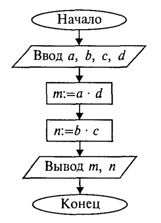
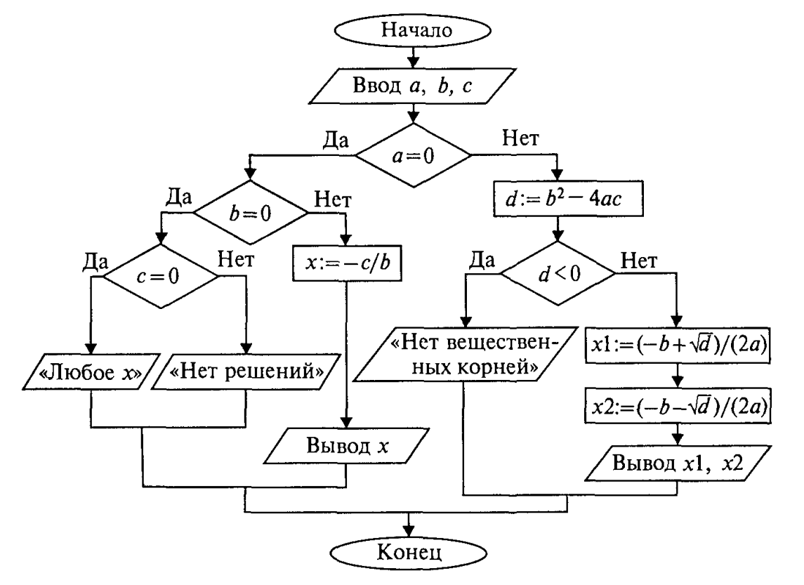
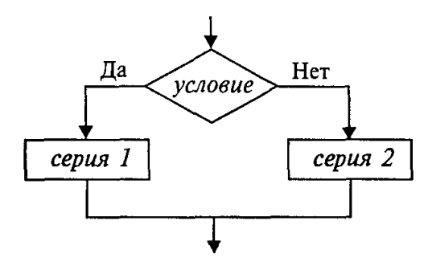
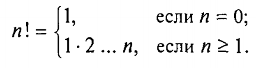
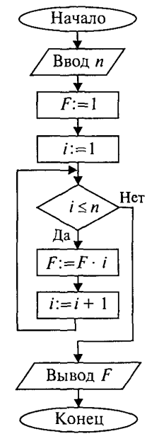
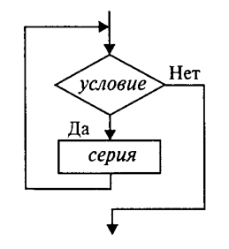
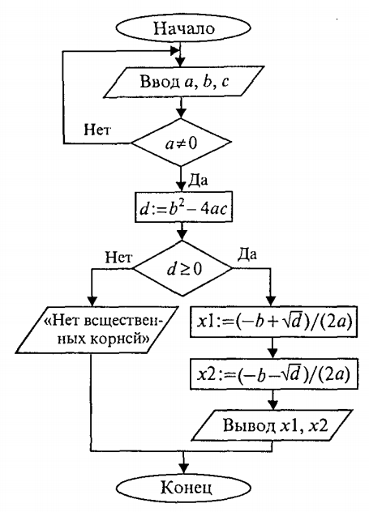
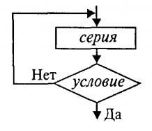
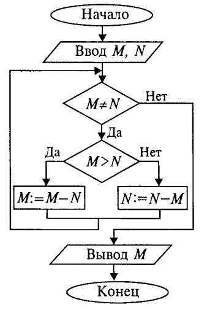
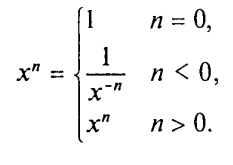

# Лекция 2. Основные алгоритмические конструкции (Algorithmic Constructs)

Алгоритм применительно к вычислительной машине — точное предписание, то есть набор операций и правил их чередования, при помощи которого, начиная с некоторых исходных данных, можно решить любую задачу фиксированного типа.

Алгоритмы в зависимости от цели, начальных условий задачи, путей её решения, определения действий исполнителя подразделяются следующим образом:

- **Линейный алгоритм** — набор команд, выполняемых последовательно друг за другом.
- **Разветвляющийся алгоритм** — алгоритм, содержащий хотя бы одно условие, в результате проверки которого выполняется один из двух возможных шагов.
- **Циклический алгоритм** — алгоритм, предусматривающий многократное повторение одной и той же последовательности действий над новыми исходными данными.

## Линейные алгоритмы

Основным элементарным действием в линейных алгоритмах является *присваивание значения переменной величине*. Если значение константы определено видом её записи, то переменная величина получает конкретное значение только в результате присваивания. Присваивание может осуществляться двумя способами: с помощью команды присваивания и с помощью команды ввода.

Рассмотрим пример. В школьном учебнике математики правила деления обыкновенных дробей описаны так:

1. Числитель первой дроби умножить на знаменатель второй.
2. Знаменатель первой дроби умножить на числитель второй.
3. Записать дробь, числитель которой — результат пункта 1, а знаменатель — пункта 2.

В алгебраической форме это выглядит так:

$$
\frac{a}{b} : \frac{c}{d} = \frac{a \cdot d}{b \cdot c} = \frac{m}{n}
$$

Построим алгоритм деления дробей для ЭВМ. Сохраним те же обозначения переменных. Исходные данные — целочисленные переменные `a`, `b`, `c`, `d`. Результат — целые величины `m` и `n`.



=== "Python"

    ```python
    a, b, c, d = map(int, input().split())
    m = a * d
    n = b * c
    print(m, n)
    ```

=== "Go"

    ```go
    package main

    import "fmt"

    func main() {
        var a, b, c, d int
        fmt.Scan(&a, &b, &c, &d)
        m := a * d
        n := b * c
        fmt.Println(m, n)
    }
    ```

### Команда присваивания

Формат команды присваивания:

```text
переменная := выражение
```

Знак `:=` в псевдокоде читается как «присвоить» (в Python и Go используется `=`, причём в Go объявление с инициализацией — `:=`).

Команда присваивания обозначает следующие действия:

1. Вычисляется выражение.
2. Полученное значение присваивается переменной.

В описаниях алгоритмов необязательно соблюдать строгие правила записи выражений — их можно писать в обычной математической форме. Это ещё не язык программирования со строгим синтаксисом.

### Команды ввода и вывода

Кроме присваивания, для получения данных извне и вывода результатов используются команды ввода и вывода. При выполнении команды ввода процессор прерывает работу и ожидает действий пользователя — обычно ввода значений с клавиатуры. Команда вывода направляет результаты на экран или другое устройство.

Обычно с помощью команды ввода присваиваются значения исходных данных, а команда присваивания используется для получения промежуточных и конечных величин.

### Свойства команды присваивания

Рассмотрим последовательное выполнение четырёх команд:

| Команда     | a | b |
|-------------|---|---|
| `a := 1`    | 1 | — |
| `b := a*2`  | 1 | 2 |
| `a := b`    | 2 | 2 |
| `b := a+b`  | 2 | 4 |

Этот пример иллюстрирует три основных свойства команды присваивания:

- пока переменной не присвоено значение, она остаётся неопределённой;
- значение, присвоенное переменной, сохраняется в ней вплоть до выполнения следующей команды присваивания этой переменной;
- новое значение, присваиваемое переменной, заменяет её предыдущее значение.

### Обмен значениями двух переменных

Даны две величины: `X` и `Y`. Требуется произвести между ними обмен значениями. Например, если первоначально `X = 1, Y = 2`, то после обмена должно стать `X = 2, Y = 1`.

Хорошая аналогия — два стакана: один с молоком, другой с водой. Чтобы обменять содержимое, нужен третий пустой стакан. Аналогично для обмена значениями двух переменных нужна третья переменная `Z`:

| Команда     | X | Y | Z |
|-------------|---|---|---|
| ввод X, Y   | 1 | 2 | — |
| `Z := X`    | 1 | 2 | 1 |
| `X := Y`    | 2 | 2 | 1 |
| `Y := Z`    | 2 | 1 | 1 |

В Python и Go обмен можно сделать и без вспомогательной переменной — через *множественное присваивание*:

=== "Python"

    ```python
    x, y = 1, 2
    x, y = y, x  # x=2, y=1
    ```

=== "Go"

    ```go
    x, y := 1, 2
    x, y = y, x // x=2, y=1
    ```

## Разветвляющиеся алгоритмы

Составим алгоритм решения квадратного уравнения \(a x^2 + b x + c = 0\). Исходные данные — коэффициенты \(a\), \(b\), \(c\). Решением в общем случае будут два корня \(x_1\) и \(x_2\), которые вычисляются по формуле:

$$
x_{1,2} = \frac{-b \pm \sqrt{b^2 - 4ac}}{2a}
$$

«Наивная» реализация выглядит так:

=== "Python"

    ```python
    import math

    a, b, c = map(float, input().split())
    d = b * b - 4 * a * c
    x1 = (-b + math.sqrt(d)) / (2 * a)
    x2 = (-b - math.sqrt(d)) / (2 * a)
    print(x1, x2)
    ```

=== "Go"

    ```go
    var a, b, c float64
    fmt.Scan(&a, &b, &c)
    d := b*b - 4*a*c
    x1 := (-b + math.Sqrt(d)) / (2 * a)
    x2 := (-b - math.Sqrt(d)) / (2 * a)
    fmt.Println(x1, x2)
    ```

Слабость такого алгоритма видна невооружённым глазом — он не обладает важнейшим свойством качественного алгоритма: универсальностью по отношению к исходным данным. *Какими бы ни были значения исходных данных, алгоритм должен приводить к определённому результату и завершать работу.* Результатом может быть число или сообщение о том, что задача решения не имеет.

Чтобы построить универсальный алгоритм, требуется тщательно проанализировать математическое содержание задачи. Решение зависит от значений коэффициентов:

- если `a = 0, b = 0, c = 0` — любое `x` решение;
- если `a = 0, b = 0, c ≠ 0` — действительных решений нет;
- если `a = 0, b ≠ 0` — линейное уравнение, одно решение `x = −c/b`;
- если `a ≠ 0` и `D = b² − 4ac ≥ 0` — два вещественных корня;
- если `a ≠ 0` и `D < 0` — вещественных корней нет.



=== "Python"

    ```python
    import math

    a, b, c = map(float, input().split())
    if a == 0:
        if b == 0:
            if c == 0:
                print('любое X')
            else:
                print('нет решений')
        else:
            print(-c / b)
    else:
        d = b * b - 4 * a * c
        if d < 0:
            print('нет вещественных корней')
        else:
            x1 = (-b + math.sqrt(d)) / (2 * a)
            x2 = (-b - math.sqrt(d)) / (2 * a)
            print(x1, x2)
    ```

=== "Go"

    ```go
    var a, b, c float64
    fmt.Scan(&a, &b, &c)
    switch {
    case a == 0 && b == 0 && c == 0:
        fmt.Println("любое X")
    case a == 0 && b == 0:
        fmt.Println("нет решений")
    case a == 0:
        fmt.Println(-c / b)
    default:
        d := b*b - 4*a*c
        if d < 0 {
            fmt.Println("нет вещественных корней")
        } else {
            x1 := (-b + math.Sqrt(d)) / (2 * a)
            x2 := (-b - math.Sqrt(d)) / (2 * a)
            fmt.Println(x1, x2)
        }
    }
    ```

В этом алгоритме многократно использована *структурная команда ветвления*:



Общий вид команды ветвления в псевдокоде:

```text
если условие то серия1
иначе серия2
```

Вначале проверяется условие. Если оно истинно, выполняется *серия 1* (положительная ветвь). В противном случае выполняется *серия 2* (отрицательная ветвь). Если на ветвях одного ветвления содержатся другие ветвления, такой алгоритм имеет структуру *вложенных ветвлений*.

## Циклические алгоритмы

### Цикл с предусловием (while)

Рассмотрим следующую задачу: дано целое положительное число `n`. Требуется вычислить `n!` (факториал):



Используются три переменные целого типа: `n` — аргумент; `i` — промежуточная переменная; `F` — результат.



Для проверки правильности алгоритма построена *трассировочная таблица* для случая `n = 3`:

| Шаг | n | F | i | Условие   |
|:---:|:-:|:-:|:-:|-----------|
| 1   | 3 |   |   |           |
| 2   |   | 1 |   |           |
| 3   |   |   | 1 |           |
| 4   |   |   |   | 1≤3, да   |
| 5   |   | 1 |   |           |
| 6   |   |   | 2 |           |
| 7   |   |   |   | 2≤3, да   |
| 8   |   | 2 |   |           |
| 9   |   |   | 3 |           |
| 10  |   |   |   | 3≤3, да   |
| 11  |   | 6 |   |           |
| 12  |   |   | 4 |           |
| 13  |   |   |   | 4≤3, нет  |
| 14  |   | вывод |  |        |

=== "Python"

    ```python
    n = int(input())
    f = 1
    i = 1
    while i <= n:
        f = f * i
        i = i + 1
    print(f)
    ```

=== "Go"

    ```go
    var n int
    fmt.Scan(&n)
    f, i := 1, 1
    for i <= n {
        f = f * i
        i = i + 1
    }
    fmt.Println(f)
    ```

Алгоритм имеет циклическую структуру. Использована *структурная команда «цикл-пока»*, или *цикл с предусловием*. Общий вид в блок-схеме:



```text
пока условие:
  серия
```

Выполнение тела цикла повторяется, пока условие истинно. Когда условие становится ложным, цикл заканчивает работу.

### Цикл с постусловием (do-while)

Цикл с предусловием — основная, но не единственная форма организации циклических алгоритмов. Другой вариант — *цикл с постусловием*. Вернёмся к алгоритму решения квадратного уравнения: если `a = 0`, это уже не квадратное уравнение. Будем считать, что пользователь ошибся при вводе, и предложим ему повторить ввод. Наличие такого контроля — признак хорошего качества программы.



=== "Python"

    ```python
    import math

    while True:
        a, b, c = map(float, input().split())
        if a != 0:
            break

    d = b * b - 4 * a * c
    if d >= 0:
        x1 = (-b + math.sqrt(d)) / (2 * a)
        x2 = (-b - math.sqrt(d)) / (2 * a)
        print(x1, x2)
    else:
        print('нет вещественных корней')
    ```

=== "Go"

    ```go
    var a, b, c float64
    for {
        fmt.Scan(&a, &b, &c)
        if a != 0 {
            break
        }
    }
    d := b*b - 4*a*c
    if d >= 0 {
        x1 := (-b + math.Sqrt(d)) / (2 * a)
        x2 := (-b - math.Sqrt(d)) / (2 * a)
        fmt.Println(x1, x2)
    } else {
        fmt.Println("нет вещественных корней")
    }
    ```

> В Python и Go нет отдельной синтаксической формы `repeat ... until`/`do ... while` — её эмулируют через бесконечный цикл с `break` по условию.

Общий вид *цикла с постусловием* (он же «цикл-до»):



```text
повторять:
  серия
до условие
```

Используется *условие окончания цикла*. Когда оно становится истинным, цикл завершается. В отличие от цикла с предусловием, тело цикла с постусловием гарантированно выполняется хотя бы один раз.

### Цикл с вложенным ветвлением — алгоритм Евклида

Даны два натуральных числа `M` и `N`. Требуется вычислить их наибольший общий делитель — НОД(M, N).

Эта задача решается *алгоритмом Евклида*. Его идея основана на свойстве: если `M > N`, то НОД(M, N) = НОД(M − N, N). Другой факт, лежащий в основе алгоритма: НОД(M, M) = M.

Для «ручного» выполнения алгоритм можно описать так:

1. Если числа равны, взять их общее значение в качестве ответа; иначе продолжить.
2. Определить большее из чисел.
3. Заменить большее число разностью большего и меньшего.
4. Вернуться к выполнению пункта 1.



=== "Python"

    ```python
    m, n = map(int, input().split())
    while m != n:
        if m > n:
            m = m - n
        else:
            n = n - m
    print(m)
    ```

=== "Go"

    ```go
    var m, n int
    fmt.Scan(&m, &n)
    for m != n {
        if m > n {
            m = m - n
        } else {
            n = n - m
        }
    }
    fmt.Println(m)
    ```

Алгоритм имеет структуру *цикла с вложенным ветвлением*. Проделайте самостоятельно трассировку для случая `M = 18, N = 12` — должно получиться НОД = 6.

## Вспомогательные алгоритмы и процедуры

В теории алгоритмов известно понятие *вспомогательного алгоритма* — алгоритма решения некоторой подзадачи из основной решаемой задачи. В таком случае алгоритм решения исходной задачи называется *основным алгоритмом*.

В качестве примера рассмотрим следующую задачу: составить алгоритм вычисления степенной функции с целым показателем `y = x^k`, где `k` — целое число, `x ≠ 0`. В алгебре эта функция определена так:



Для данной задачи в качестве подзадачи можно рассматривать возведение числа в *целую положительную* степень. Учитывая, что `1/x^(−n) = (1/x)^n`, запишем основной алгоритм:

=== "Python"

    ```python
    def stepen(a: float, k: int) -> float:
        """Возведение в целую положительную степень."""
        z = 1.0
        i = 1
        while i <= k:
            z = z * a
            i = i + 1
        return z

    x = float(input())
    n = int(input())
    if n == 0:
        y = 1.0
    elif n > 0:
        y = stepen(x, n)
    else:
        y = stepen(1 / x, -n)
    print(y)
    ```

=== "Go"

    ```go
    func stepen(a float64, k int) float64 {
        z := 1.0
        for i := 1; i <= k; i++ {
            z = z * a
        }
        return z
    }

    func main() {
        var x float64
        var n int
        fmt.Scan(&x, &n)

        var y float64
        switch {
        case n == 0:
            y = 1.0
        case n > 0:
            y = stepen(x, n)
        default:
            y = stepen(1/x, -n)
        }
        fmt.Println(y)
    }
    ```

В программе дважды присутствует обращение к вспомогательной функции `stepen`. Это алгоритм возведения вещественного основания в целую положительную степень путём многократного перемножения. Величины, стоящие в скобках при вызове, называются *фактическими параметрами*.

При определении функции в скобках перечисляются *формальные параметры* — с указанием их типов (явно в Go, опциональными аннотациями в Python). Между формальными и фактическими параметрами должны выполняться следующие правила соответствия:

- **по количеству** — сколько формальных, столько и фактических;
- **по последовательности** — первому формальному соответствует первый фактический параметр, и т. д.;
- **по типам** — типы соответствующих формальных и фактических параметров должны совпадать.

Фактические параметры могут быть выражениями соответствующего типа.

Обращение к функции инициирует следующие действия:

1. Значения фактических параметров присваиваются соответствующим формальным.
2. Выполняется тело функции.
3. Возвращаемое значение передаётся в место вызова, и происходит переход к выполнению следующей команды.

В функции `stepen` нет команд ввода/вывода — начальные значения аргументов приходят через параметры, а результат возвращается оператором `return`. Таким образом, передача значений через параметры функций — это *третий способ присваивания* (наряду с командой присваивания и командой ввода).

Использование функций позволяет строить сложные алгоритмы методом *последовательной детализации*.

## Прочие виды алгоритмов

- **Вероятностный (стохастический) алгоритм** даёт программу решения задачи несколькими путями, приводящими к *вероятному* достижению результата.
- **Эвристический алгоритм** (от греческого «эврика») — алгоритм, в котором достижение конечного результата однозначно не предопределено, как не обозначена вся последовательность действий. К эвристическим относятся, например, инструкции и предписания. В них используются универсальные логические процедуры и способы принятия решений, основанные на аналогиях, ассоциациях и прошлом опыте.

## Программы для графического отображения алгоритмов

- <https://draw.io> (онлайн)
- [Mermaid](https://mermaid.js.org/) — встроен в сайт курса, диаграмма прямо в markdown:

    ```mermaid
    flowchart TD
        A[Старт] --> B{t < 0?}
        B -- да --> C[надеть шубу]
        B -- нет --> D[надеть куртку]
        C --> E[Конец]
        D --> E
    ```

- Microsoft Visio
- Dia (бесплатная)
