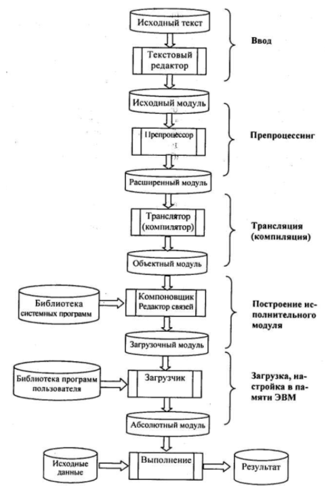
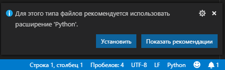
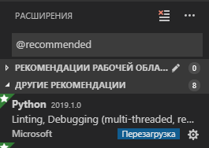
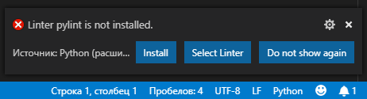
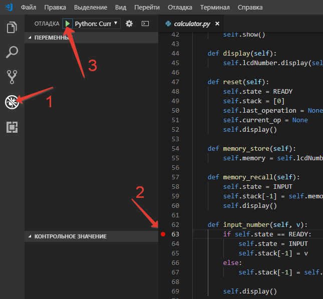
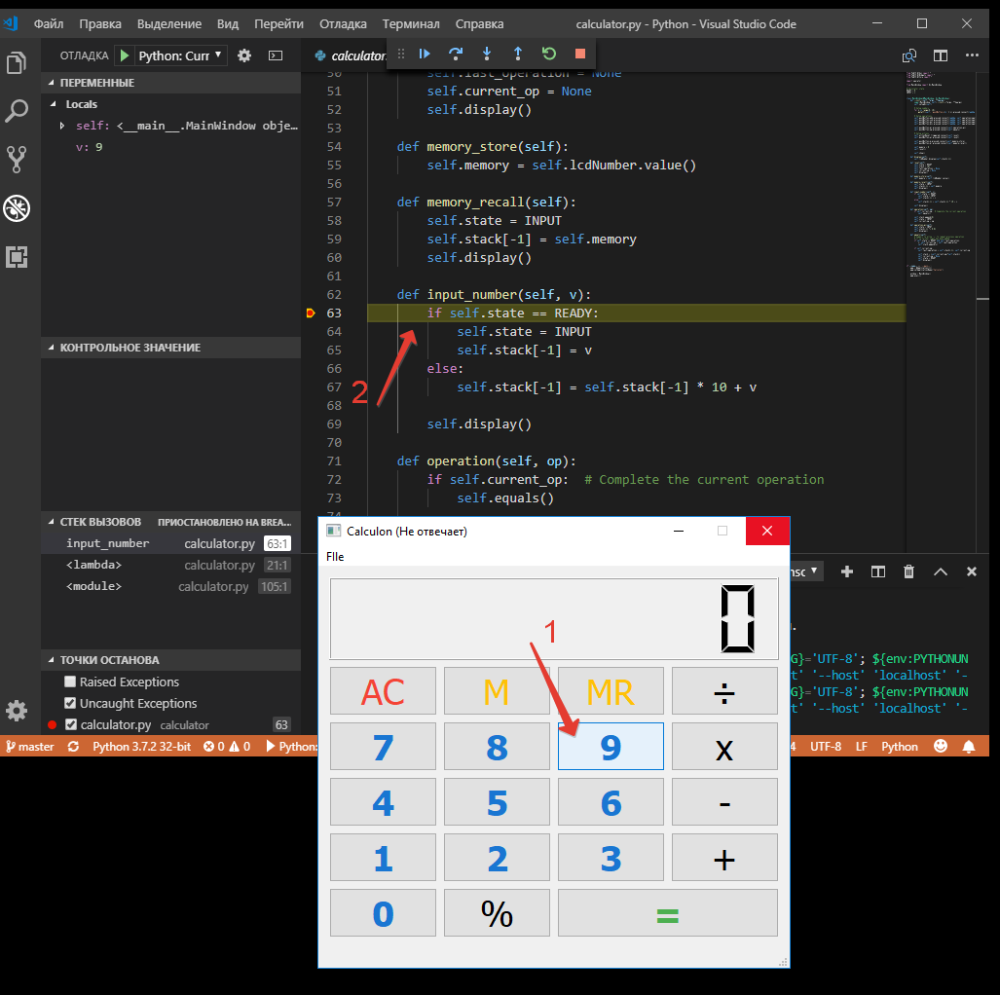

# Лекция 1. Языки программирования и системы программирования (Languages and Programming Systems)

> **Срез знаний по предыдущей теме.** Нарисуйте блок-схему для одной-двух задач из списка:
>
> - даны 3 числа — вывести на экран большее из них;
> - вычислить значение модуля и квадратного корня из выражения `(x − y)`;
> - подсчитать количество символов во введённом с клавиатуры предложении (цифры, пробелы и знаки препинания не учитываются);
> - дана строка — подсчитать количество пробелов в ней;
> - даны три числа — возвести в квадрат отрицательные, положительные возвести в куб, вывести результаты;
> - даны координаты двух точек — определить, которая ближе к началу координат;
> - даны два угла треугольника — определить, может ли существовать треугольник с такими углами, если да — является ли он прямоугольным;
> - даны два разных числа — меньшее заменить половиной их суммы, большее — утроенным произведением;
> - в первый день спортсмен пробежал 10 км, каждый следующий — на 10 % больше, чем в предыдущий — найти, сколько всего он пробежал за неделю;
> - амёба каждые два часа делится пополам — сколько амёб будет через X часов;
> - найти сумму большего и меньшего из трёх чисел, используя подпрограммы;
> - составить таблицу истинности для выражений: `~A & ~B | C`, `~A | B & C`, `A & B | ~C`.

## Языки программирования

**Язык программирования** — это способ записи программ решения задач на компьютере в понятной для компьютера форме.

Процессор компьютера непосредственно понимает *язык машинных команд*. Программы на нём писали лишь для самых первых ламповых машин — ЭВМ первого поколения. Программирование на машинном языке — дело непростое: программист должен знать числовые коды всех машинных команд и сам распределять память под команды и данные.

## Эволюция языков программирования

В 1950-х появляются первые средства автоматизации программирования — *автокоды*. Позднее для языков этого уровня закрепилось название «Ассемблеры».

Появление Ассемблера облегчило участь программистов. Переменные стали изображаться символическими именами. Числовые коды операций заменились на мнемонические (словесные) обозначения, которые легче запомнить.

Язык программирования стал понятнее для человека, но при этом удалился от языка машинных команд. Чтобы компьютер мог исполнять программы на Ассемблере, потребовался специальный переводчик — *транслятор*. Транслятор — системная программа, переводящая текст программы на Ассемблере в эквивалентную программу на языке машинных команд.

```asm
fact:
    push rbp
    mov rbp, rsp
    mov rbx, qword [rbp + 16]
    cmp rbx, 1
    jle fact_set_1
    mov rcx, rbx
    dec rcx
    push rcx
    call fact
    mov rbx, qword [rbp + 16]
    mul rbx
    jmp fact_end
fact_set_1:
    mov rax, 1
fact_end:
    pop rbp
    ret 8
```

Компьютер, оснащённый транслятором с Ассемблера, фактически «понимает» Ассемблер — в этом смысле можно говорить о *псевдо-ЭВМ* (аппаратура плюс транслятор).

Языки типа Ассемблер являются *машинно-ориентированными* — они настроены на структуру машинных команд конкретного компьютера. Разные процессоры имеют разный Ассемблер.

## Классификация языков программирования

*Язык машинных команд* и *ассемблер* — **языки низкого уровня**. Язык низкого уровня предназначен для определённого типа компьютера и отражает его внутренний машинный код; такие языки часто называют машинно-ориентированными. Их сложно конвертировать для использования на компьютерах с разными процессорами, а также непросто изучать — требуется хорошо знать внутренние принципы работы компьютера.

Помучавшись с языками низкого уровня, человечество придумало **языки высокого уровня**.

Язык высокого уровня предназначен для программиста и не зависит от внутренних машинных кодов компьютера любого типа. Языки высокого уровня используются для решения проблем, поэтому их часто называют *проблемно-ориентированными*. Каждая команда языка высокого уровня эквивалентна нескольким командам в машинных кодах — поэтому программы, написанные на них, более компактны.

Одна и та же программа на языке высокого уровня может быть выполнена на компьютерах разных типов, оснащённых соответствующим транслятором. Форма записи программ ближе к традиционной математической форме и естественному языку. Языки высокого уровня легко изучаются и хорошо поддерживают структурную методику программирования.

> **Краткая историческая справка.** Первыми популярными языками высокого уровня в 1950-х были Fortran, Cobol (США) и Algol (Европа). Fortran и Algol — для научно-технических расчётов, Cobol — для экономических задач. В 1965 г. в Дартмутском университете был разработан BASIC — простой язык для начинающих. PL/1 (IBM) — первая попытка универсального языка. Pascal (Никлаус Вирт, 1971) разрабатывался как учебный язык структурного программирования; позже на его базе появились Object Pascal и Delphi. Си (1972) создавался как инструментальный язык для разработки операционных систем — на его основе позже возник C++ (ООП). Прототипы языков «искусственного интеллекта» — LISP (1965, на основе рекурсивных функций) и Prolog (1972, Франция).

Реализовать язык программирования на ЭВМ — значит создать *транслятор* с этого языка для архитектуры процессора.

Существуют два принципиально разных метода трансляции — **компиляция** и **интерпретация**. Аналогия: лектор выступает перед аудиторией на незнакомом ей языке. Перевод можно организовать двумя способами:

- *полный предварительный перевод* — лектор заранее передаёт текст переводчику, тот переводит и раздаёт слушателям (лектор может и не выступать) — это **компиляция**;
- *синхронный перевод* — лектор читает доклад, переводчик одновременно с ним переводит слово в слово — это **интерпретация**.

При компиляции в память загружается программа-компилятор, она воспринимает текст программы на языке высокого уровня и формирует программу на языке машинных команд, которая затем выполняется самостоятельно.

Интерпретатор находится в памяти всё время работы программы. Он последовательно «читает» оператор за оператором, переводит и сразу выполняет. Результаты предыдущих переводов не сохраняются — при повторном выполнении одной и той же команды она снова транслируется. Откомпилированная программа выполняется быстрее интерпретируемой.

Всё это было востребовано в эпоху господства Wintel (Windows + Intel) — одна ОС, одна платформа. Сейчас значительную часть рынка отвоевал Android, набирает популярность Linux, на рынке процессоров господствует ARM. Прикладным программам стала требоваться *кроссплатформенность* — на фоне возросшей мощности компьютерного «железа» востребованы интерпретируемые языки, поскольку для кроссплатформенности «достаточно» сделать интерпретатор под нужную ОС и платформу.

Если посмотреть на TOP-востребованных языков (с учётом всё ещё растущего сектора серверной разработки), сегодня в нём типично присутствуют:

- Python — лидер по простоте, ML/Data Science, DevOps;
- JavaScript / TypeScript — фронтенд и Node.js;
- Java — корпоративные системы, Android;
- C# — .NET, gamedev;
- **Go (Golang)** — высоконагруженные сервисы, инфраструктура, CLI;
- Rust — системное программирование с гарантиями безопасности памяти;
- C/C++ — системы, gamedev, встраиваемые.

В современной разработке скоростью выполнения программы часто пренебрегают в пользу *скорости разработки*. Порог входа в Python, JS и Go значительно ниже, чем в C или Ассемблер.

## Понятие системы программирования

**Система программирования** — комплекс инструментальных программных средств, предназначенный для разработки программ на одном или нескольких языках программирования. Современная система программирования обычно включает:

- компилятор или интерпретатор;
- интегрированную среду разработки (IDE);
- средства создания и редактирования текстов программ;
- обширные библиотеки стандартных программ и функций;
- отладочные программы (debugger);
- «дружественную» к пользователю диалоговую среду;
- многооконный режим работы;
- мощные графические библиотеки, утилиты для работы с библиотеками;
- встроенный ассемблер;
- встроенную справочную службу.

Многие системы программирования включают также средства *RAD* (Rapid Application Development) — например, способ быстрой разработки графического интерфейса.

### Классификация систем программирования

По набору входных языков — *одноязыковые* и *многоязыковые*. Отличительная черта многоязыковых: отдельные части программы можно составлять на разных языках и с помощью обрабатывающих программ объединять в готовую для исполнения.

По структуре, уровню формализации входного языка и целевому назначению — *машинно-ориентированные* и *машинно-независимые* системы программирования.

Машинно-ориентированные системы программирования имеют входной язык, операторы и изобразительные средства которого существенно зависят от особенностей ЭВМ. Преимущества:

- высокое качество создаваемых программ;
- возможность использования конкретных аппаратных ресурсов;
- предсказуемость объектного кода и заказов памяти.

Недостатки:

- для составления эффективных программ необходимо знать систему команд ЭВМ;
- трудоёмкость процесса составления программ, плохо защищённого от ошибок;
- низкая скорость программирования;
- невозможность непосредственного использования программ на ЭВМ других типов.

### Транслятор, компилятор, интерпретатор

**Транслятор** — программа-переводчик. Преобразует программу на языке высокого уровня в программу, состоящую из машинных команд. Реализуется как компилятор или интерпретатор.

**Компилятор** читает всю программу целиком, делает её перевод и создаёт законченный вариант на машинном языке, который затем выполняется. После компиляции ни исходник, ни сам компилятор для запуска не нужны.

**Интерпретатор** переводит и выполняет программу строка за строкой. Программа, обрабатываемая интерпретатором, должна заново переводиться при каждом очередном запуске.

Откомпилированные программы работают быстрее, но интерпретируемые проще исправлять и изменять. Иногда для одного языка имеется и компилятор, и интерпретатор. В этом случае для разработки и тестирования можно пользоваться интерпретатором, а затем откомпилировать отлаженную программу для повышения скорости.

**Go** — характерный пример *компилируемого* языка высокого уровня: `go build` производит самодостаточный нативный бинарь для целевой ОС/архитектуры. **Python** — характерный *интерпретируемый*: исходник `*.py` запускается интерпретатором CPython (или PyPy, MicroPython и т. д.).

### Отладчик в системе программирования

**Отладка** — этап разработки компьютерной программы, на котором обнаруживают, локализуют и устраняют ошибки. Чтобы понять, где возникла ошибка, приходится:

- узнавать текущие значения переменных;
- выяснять, по какому пути выполнялась программа.

Существуют две взаимодополняющие технологии отладки.

- **Использование отладчиков** — программ с пользовательским интерфейсом для пошагового выполнения программы: оператор за оператором, функция за функцией, с остановками на некоторых строках исходного кода или при достижении определённого условия.
- **Вывод текущего состояния программы** с помощью операторов вывода, расположенных в критических точках — на экран, в файл или другой регистратор. Вывод отладочных сведений в файл называется *журналированием* (logging).

Отладчик обеспечивает трассировку, выполняет остановы в указанных точках или при заданных условиях, позволяет просматривать текущие значения переменных, содержимое памяти, а иногда и регистров процессора, и при необходимости изменять эти значения.

### Популярные системы программирования

1. **Visual Studio Code** (Microsoft) — активно развивающийся, бесплатный редактор исходного кода для Windows, Linux и macOS. Кроссплатформенный, расширяемый плагинами под практически любой язык. Включает отладчик, интеграцию с Git, IntelliSense, инструменты рефакторинга. Подробнее — в [Теме 7](../07-ide-vscode/index.md).
2. **PyCharm** (JetBrains) — лучшая IDE для Python; есть бесплатная Community Edition. Поддерживает Python, веб-фреймворки, Cython, JS/TS, HTML/CSS.
3. **GoLand** (JetBrains) — IDE для Go от того же вендора; платная, но имеет 30-дневный пробный период и бесплатные лицензии для студентов.
4. **Microsoft Visual Studio** — полноценный IDE, есть бесплатная Community Edition для некоммерческой разработки. Поддерживает C#, C++, Visual Basic, F#, .NET и др.
5. **NetBeans**, **Eclipse** — кроссплатформенные бесплатные IDE с длинной историей.

## Исходный, объектный и загрузочный модули

Рассмотрим структуру абстрактной многоязыковой, открытой, *компилирующей* системы программирования и процесс разработки приложений.



1. **Ввод.** Программа на исходном языке (исходный модуль) готовится с помощью текстовых редакторов и в виде файла поступает на вход транслятора.
2. **Трансляция** — преобразование исходного модуля в *объектную форму*. В общем случае включает в себя препроцессинг и компиляцию.
3. **Препроцессинг** — необязательная фаза: анализ исходного текста, извлечение и выполнение директив препроцессора. Директивы препроцессора — помеченные спецсимволами (обычно `#`, `%`, `&`) строки.
4. **Компиляция** — в общем случае многоступенчатый процесс, включающий:
    - *синтаксический анализ* — проверка правильности конструкций;
    - *семантический анализ* — выявление несоответствий типов и структур переменных, функций и процедур;
    - *генерация объектного кода* — завершающая фаза.

    *Объектный модуль* — текст программы на машинном языке (машинные инструкции, словари, служебная информация). Объектный модуль не работоспособен — он содержит неразрешённые ссылки на вызываемые подпрограммы библиотек.
5. **Построение исполнительного модуля.** Выполняется *редактором связей* / *компоновщиком* (linker), основная функция которого — объединение объектных и загрузочных модулей в единый загрузочный модуль с последующей записью в библиотеку или файл.
6. **Загрузка программы.** Обычно делается операционной системой. Загрузочный модуль помещается в качестве файла на диске. При выполнении он загружается в оперативную память, настраивается по месту и получает управление. Образ загрузочного модуля в памяти называется *абсолютным модулем* — все команды получают окончательную форму и абсолютные адреса.

Современные системы программирования позволяют удобно переходить от одного этапа к другому в рамках *интегрированной среды программирования* (IDE).

## Интегрированная среда программирования

Поскольку для изучения мы выбрали Python (плюс Go в более поздних темах), сразу будем разворачивать среду для разработки. Visual Studio Code (VS Code) — лёгкий, бесплатный и кроссплатформенный — подходит и для Python, и для Go.

1. Установите Python 3: <https://www.python.org/downloads/> (на macOS удобнее через `brew`, на Linux — из менеджера пакетов).
2. Установите Go: <https://go.dev/dl/>.
3. Установите Visual Studio Code: <https://code.visualstudio.com/download>.

> Если VS Code не определит автоматически русский язык, можно вручную добавить поддержку: [Russian Language Pack for VS Code](https://marketplace.visualstudio.com/items?itemName=MS-CEINTL.vscode-language-pack-ru).

«Из коробки» вы получаете редактор кода с подсветкой синтаксиса, технологией IntelliSense (автоподстановка переменных, методов), поддержкой Git и встроенным отладчиком.

Откроем какой-нибудь Python-проект. *Файл → Открыть папку*, выбираем папку с проектом, открываем файл с расширением `.py`:



VS Code определит, что сам с этим форматом работать не умеет, и предложит установить расширение. Жмём **Установить**:



VS Code установит рекомендуемое расширение (на один и тот же тип файлов может быть несколько от разных разработчиков; здесь разработчик — сама Microsoft) и предложит перезагрузиться:



После перезагрузки видно, что VS Code не хватает линтера. **Линтер** — статический анализатор для языка программирования, сообщающий о подозрительных или непереносимых выражениях. Дело нужное — тоже ставим.

Теперь можно попробовать запустить отладку:



1. Переключаем левую панель в режим отладки (там потом появятся видимые переменные).
2. Ставим точку останова (breakpoint).
3. Запускаем проект.

После срабатывания breakpoint отладчик остановится:



В панели отладки слева — локальные переменные и стек вызовов: видно, что и откуда пришло в нашу точку останова. Можно пошагово выполнить программу и посмотреть, как меняются переменные или где возникает ошибка. Управлять отладкой можно кнопками сверху или клавишами (показываются при наведении).

Для Go-разработки достаточно установить официальное расширение **Go** (Google) — оно автоматически предложит установить вспомогательные инструменты (`gopls`, `dlv` для отладки, `gofmt`, `goimports`).

## Домашнее задание

- Сформулируйте классификацию языков программирования.
- Объясните разницу между компиляцией и интерпретацией. К какой группе относятся Python и Go?
- Опишите схему обработки прикладных программ в среде системы программирования (этапы).
- Установите VS Code, Python 3 и Go; настройте VS Code для работы с обоими языками; проверьте отладку на произвольном проекте.
