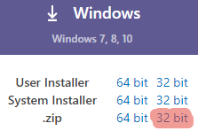
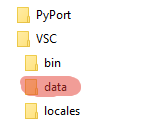
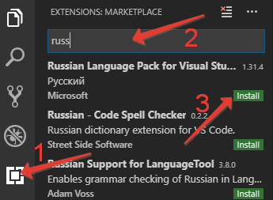
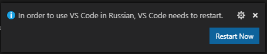
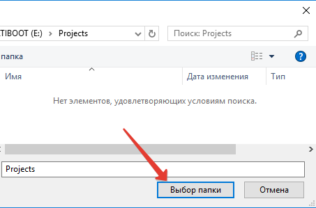
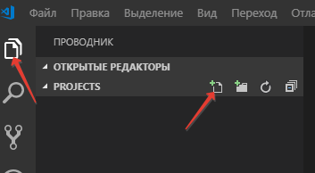
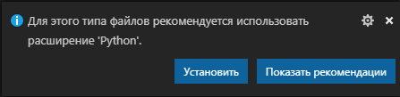
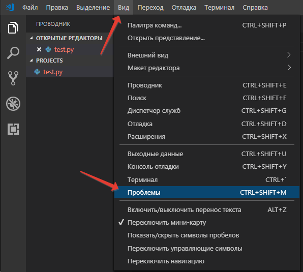
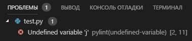
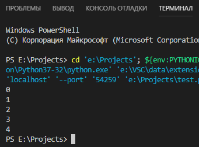

# Лекция 1. Среда разработки: Visual Studio Code (Setup)

Интегрированных сред разработки (IDE), сделанных специально для Python, фактически нет — большинство современных редакторов и IDE поддерживают разработку сразу на нескольких языках. На занятиях мы используем **Visual Studio Code** (VS Code) — лёгкий кроссплатформенный бесплатный редактор от Microsoft с поддержкой плагинов. Расширения превращают его в полноценную IDE для Python, Go, JavaScript и десятков других языков.

В этой лекции:

- установим VS Code (в том числе в переносном режиме);
- русифицируем интерфейс;
- настроим расширения для Python и Go;
- разберёмся со встроенным отладчиком.

## Установка

Скачайте дистрибутив с [официальной страницы](https://code.visualstudio.com/Download). Под Windows доступны три варианта: установщик пользовательский (`User Installer`), системный (`System Installer`) и архив `.zip` для переносного (portable) режима. Под macOS — `.dmg` или `.zip`, под Linux — `.deb`/`.rpm` или tarball.

### Переносной режим (portable)

Переносной режим хранит все настройки в подкаталоге программы, не трогая реестр или домашний каталог пользователя. Это позволяет носить VS Code на флешке и пользоваться им на любом компьютере.

Для перевода в портативный режим:

1. Скачайте дистрибутив в виде `.zip`-архива (на Windows — обязательно, на macOS/Linux — также есть `.zip`/`tar.gz`).

    

2. Распакуйте архив в любой каталог на носителе.
3. Создайте в этом каталоге подкаталог `data` (на macOS — `code-portable-data` рядом с приложением).

    

После следующего запуска VS Code увидит каталог `data` и перейдёт в переносной режим.

## Русификация интерфейса

VS Code поддерживает установку плагинов из магазина (Marketplace):

1. Откройте панель **Extensions** (значок с кубиками в боковой панели или `Ctrl/Cmd+Shift+X`).
2. Введите в строке поиска `russian`.
3. Найдите и установите **Russian Language Pack for Visual Studio Code**.



После установки VS Code предложит перезапустить себя — соглашайтесь.



> Русифицировать имеет смысл только локализованную версию интерфейса. На занятиях и в документации мы будем использовать английские названия пунктов меню в скобках — это полезно, потому что англоязычная документация по VS Code более полная.

## Открытие проекта

VS Code считает проектом отдельный каталог (workspace). В нём редактор хранит локальные настройки (`.vscode/settings.json`), отладочные конфигурации (`.vscode/launch.json`), там же ищет репозиторий Git и виртуальное окружение Python.

Откройте папку проекта через меню **File → Open Folder** (Файл → Открыть папку) или с экрана приветствия.



Переключитесь в режим **Explorer** (Проводник) в левой панели и создайте новый файл с расширением `.py`:



## Настройка для Python

При создании первого `.py`-файла VS Code предложит установить расширение **Python** от Microsoft — это связка из нескольких инструментов (Pylance для подсказок и типов, отладчик `debugpy`, поддержка тестов и virtualenv).



После установки и перезапуска включите панель **Problems** (Вид → Проблемы) — туда расширение выводит обнаруженные ошибки.



Напишем простой код с опечаткой и сохраним файл:

```python
for i in range(5):
    print(j)
```

В панели **Problems** появится `Undefined variable 'j'` — расширение Python отслеживает ошибки и показывает их положение в коде (строка и колонка):



Исправьте опечатку — `print(i)` — сохраните файл, теперь ошибка пропала.

### Запуск и отладка

Нажмите `F5` (или **Run → Start Debugging**) — программа запустится в встроенном терминале. При первом запуске VS Code предложит выбрать конфигурацию отладчика — выберите **Python File**.



Возможности встроенного отладчика:

- **точки останова** (breakpoints) — клик слева от номера строки;
- **шаги** — `F10` (Step Over), `F11` (Step Into), `Shift+F11` (Step Out);
- **просмотр переменных** — панель **Variables** слева;
- **выражения для слежения** — панель **Watch**;
- **стек вызовов** — панель **Call Stack**.

### Современные расширения для Python (2025)

| Расширение | Назначение |
|------------|------------|
| **Python** (`ms-python.python`) | Базовая поддержка: запуск, отладка, окружения, тесты. |
| **Pylance** (`ms-python.vscode-pylance`) | Быстрый языковой сервер: автокомплит, переходы, проверка типов. |
| **Ruff** (`charliermarsh.ruff`) | Линтер и форматтер — современная замена `flake8` + `black` + `isort`. |
| **Python Debugger** (`ms-python.debugpy`) | Адаптер отладчика (устанавливается автоматически как зависимость). |

В `pyproject.toml` обычно настраивают `ruff` и `pytest`, чтобы не повторять конфиг в каждом редакторе:

```toml
[tool.ruff]
line-length = 100
target-version = "py314"

[tool.ruff.lint]
select = ["E", "F", "I", "B", "UP"]
```

## Настройка для Go

Для Go-разработки используется официальное расширение **Go** (`golang.go`). После установки VS Code предложит подтянуть набор инструментов: `gopls` (языковой сервер), `dlv` (отладчик Delve), `gofmt`/`goimports`, `staticcheck` и др.

```bash
# Установка только Go (если ещё нет)
brew install go        # macOS
# либо скачать с https://go.dev/dl/
```

Проект Go начинается с инициализации модуля:

```bash
mkdir hello-go && cd hello-go
go mod init example.com/hello
```

Создайте `main.go`:

```go
package main

import "fmt"

func main() {
    for i := 0; i < 5; i++ {
        fmt.Println(i)
    }
}
```

Запуск из терминала — `go run .`, отладка из VS Code — `F5` (расширение Go само сконфигурирует Delve).

### Сравнение типичной настройки

| Аспект | Python | Go |
|--------|--------|-----|
| Языковой сервер | Pylance | gopls |
| Отладчик | debugpy | delve (dlv) |
| Форматтер | ruff / black | gofmt (встроен в `go fmt`) |
| Линтер | ruff / mypy | staticcheck / `go vet` |
| Менеджер зависимостей | `uv` (или `pip`/`poetry`) | `go mod` (встроен) |

## Полезные горячие клавиши

| Действие | macOS | Windows/Linux |
|----------|-------|---------------|
| Командная палитра | `Cmd+Shift+P` | `Ctrl+Shift+P` |
| Быстрое открытие файла | `Cmd+P` | `Ctrl+P` |
| Боковой переход | `Cmd+B` | `Ctrl+B` |
| Терминал | ``Cmd+` `` | ``Ctrl+` `` |
| Поиск по проекту | `Cmd+Shift+F` | `Ctrl+Shift+F` |
| Запуск отладки | `F5` | `F5` |
| Перейти к определению | `F12` | `F12` |
| Переименовать символ | `F2` | `F2` |
| Форматировать файл | `Shift+Option+F` | `Shift+Alt+F` |

## Settings Sync

VS Code умеет синхронизировать настройки, расширения и горячие клавиши между машинами через аккаунт GitHub или Microsoft (меню **Settings Sync**). Это удобнее, чем переносной режим, если работаете с собственного устройства.

---

## Контрольные вопросы

- Что такое переносной режим VS Code и в каких случаях он удобен?
- Какой минимальный набор расширений нужен для комфортной работы с Python? С Go?
- Чем `Pylance` отличается от расширения `Python`?
- Какие современные инструменты заменяют связку `flake8 + black + isort`?
- Чем горячие клавиши `F10`, `F11` и `Shift+F11` различаются в отладчике?
- Что хранится в `.vscode/launch.json`, а что — в `.vscode/settings.json`?
- Как настроить отладку Go в VS Code и какой инструмент при этом используется?
