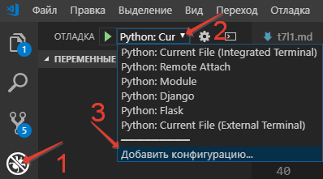
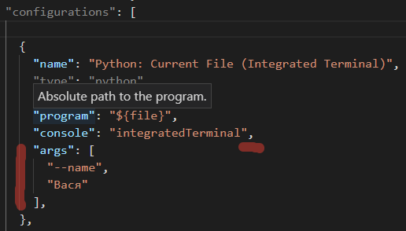

# Лекция 2. Параметры командной строки

До этого мы получали параметры в интерактивном режиме через `input()` — это удобно для обучения, но в реальных программах параметры обычно берут либо из файла настроек, либо из командной строки.

- **Файлы настроек** (`.ini`, `.toml`, `.yaml`, переменные окружения) — для параметров, которые задаются один раз и не меняются между запусками.
- **Командная строка** — для параметров, которые меняются от запуска к запуску (имена входных файлов, режимы работы, флаги).

В этой лекции — как разбирать аргументы командной строки в Python (`sys.argv` → `argparse`) и в Go (`flag` → сторонние библиотеки вроде `spf13/cobra`).

## Простейший доступ: `sys.argv`

В Python список параметров, переданных программе, лежит в `sys.argv`. Нулевой элемент — имя самого скрипта, дальше — аргументы.

```python
import sys

if __name__ == "__main__":
    for param in sys.argv:
        print(param)
```

Запуск:

```bash
python params.py one two three
# params.py
# one
# two
# three
```

В Go аналог — пакет `os`:

=== "Python"

    ```python
    import sys

    if __name__ == "__main__":
        for param in sys.argv:
            print(param)
    ```

=== "Go"

    ```go
    package main

    import (
        "fmt"
        "os"
    )

    func main() {
        for _, arg := range os.Args {
            fmt.Println(arg)
        }
    }
    ```

`os.Args[0]` — тоже имя бинарника, остальные элементы — аргументы.

## Минимальный «Hello, world» с аргументом

Заказчик попросил: «Если запустили без параметра — `Привет, мир!`, если с именем — `Привет, <имя>!`».

=== "Python"

    ```python
    import sys

    if __name__ == "__main__":
        if len(sys.argv) > 1:
            print(f"Привет, {sys.argv[1]}!")
        else:
            print("Привет, мир!")
    ```

=== "Go"

    ```go
    package main

    import (
        "fmt"
        "os"
    )

    func main() {
        if len(os.Args) > 1 {
            fmt.Printf("Привет, %s!\n", os.Args[1])
        } else {
            fmt.Println("Привет, мир!")
        }
    }
    ```

Пока всё просто. Но как только заказчик попросит именованные параметры (`--name Вася`), проверки на количество и порядок, значения по умолчанию, — код превращается в «вермишель» из `if`. Эту работу не нужно писать руками: в обоих языках есть готовые библиотеки.

## Python: `argparse`

Стандартный модуль `argparse` делает разбор командной строки декларативным.

Базовый рецепт:

1. Создать экземпляр `ArgumentParser`.
2. Описать каждый ожидаемый параметр через `add_argument`.
3. Вызвать `parse_args` — получить пространство имён с разобранными значениями.

```python
import argparse


def create_parser() -> argparse.ArgumentParser:
    parser = argparse.ArgumentParser()
    parser.add_argument("name", nargs="?", default="мир")
    return parser


if __name__ == "__main__":
    args = create_parser().parse_args()
    print(f"Привет, {args.name}!")
```

`nargs="?"` делает позиционный параметр необязательным, `default="мир"` — значение по умолчанию.

### Именованные параметры

```python
parser.add_argument("-n", "--name", default="мир")
```

Теперь запуск выглядит так:

```bash
python hello.py --name Вася
python hello.py -n Вася
```

`-n` — короткое имя, `--name` — длинное (используется как имя поля в `Namespace`).

### Значения как списки

```python
parser.add_argument("-n", "--name", nargs="+", default=["мир"])
```

`nargs="+"` — одно или больше значений (как `+` в регулярных выражениях). `*` — ноль или больше, `?` — ноль или одно, целое число — ровно столько.

```bash
python hello.py -n Вася Оля Петя
# Namespace(name=['Вася', 'Оля', 'Петя'])
```

### Выбор из вариантов и типы

```python
parser.add_argument("--format", choices=["gif", "png", "jpg"], default="png")
parser.add_argument("-c", "--count", type=int, default=1)
parser.add_argument("--config", type=argparse.FileType("r"))
```

- `choices` — допустимые значения; всё остальное — ошибка.
- `type` — функция-конвертер (`int`, `float`, кастомная).
- `argparse.FileType("r")` — безопасно открыть файл и аккуратно сообщить об ошибке.

### Флаги

```python
parser.add_argument("-v", "--verbose", action="store_true")
parser.add_argument("--no-cache", action="store_false")
```

`store_true` / `store_false` — параметр работает как флаг, при указании принимает соответствующее булево значение.

### Обязательные именованные

По умолчанию именованные параметры необязательные. Чтобы сделать обязательным:

```python
parser.add_argument("-n", "--name", required=True)
```

### Подпарсеры: команды

Если у программы есть несколько режимов (как у `git` — `add`, `commit`, `push`), используют **subparsers**.

```python
import argparse


def create_parser() -> argparse.ArgumentParser:
    parser = argparse.ArgumentParser(prog="hello")
    subparsers = parser.add_subparsers(dest="command", required=True)

    hello = subparsers.add_parser("hello", help="Поприветствовать")
    hello.add_argument("--names", "-n", nargs="+", default=["мир"])

    bye = subparsers.add_parser("goodbye", help="Попрощаться")
    bye.add_argument("-c", "--count", type=int, default=1)

    return parser


def run_hello(args: argparse.Namespace) -> None:
    for name in args.names:
        print(f"Привет, {name}!")


def run_goodbye(args: argparse.Namespace) -> None:
    for _ in range(args.count):
        print("Прощай, мир!")


if __name__ == "__main__":
    args = create_parser().parse_args()
    {"hello": run_hello, "goodbye": run_goodbye}[args.command](args)
```

Запуск:

```bash
python app.py hello --names Вася Оля
python app.py goodbye --count 3
```

### Оформление справки

`argparse` автоматически генерирует справку по `-h` / `--help`. Чтобы она читалась хорошо:

```python
parser = argparse.ArgumentParser(
    prog="hello",
    description="Учебная программа: приветствует и прощается.",
    epilog="(c) Курс ОАиП",
)
parser.add_argument(
    "--names", "-n",
    nargs="+",
    default=["мир"],
    help="Список приветствуемых людей",
    metavar="ИМЯ",
)
```

- `description` — что делает программа.
- `epilog` — текст после списка параметров.
- `help` — описание параметра.
- `metavar` — как выводится имя значения параметра (`--names ИМЯ`, а не `--names NAMES`).

### Современные альтернативы argparse

- **`click`** — декларативный API через декораторы, удобен для CLI среднего размера.
- **`typer`** — поверх `click`, использует аннотации типов Python; де-факто стандарт для FastAPI-стиля.
- **`rich-click`** — обёртка над `click` с красивой подсветкой и таблицами.

Пример на `typer`:

```python
import typer

app = typer.Typer()


@app.command()
def hello(name: str = "мир", count: int = 1) -> None:
    """Поприветствовать."""
    for _ in range(count):
        typer.echo(f"Привет, {name}!")


if __name__ == "__main__":
    app()
```

## Go: пакет `flag`

В стандартной библиотеке Go разбор флагов делает пакет `flag`. Он проще `argparse`, но покрывает большинство случаев.

```go
package main

import (
    "flag"
    "fmt"
)

func main() {
    name := flag.String("name", "мир", "имя для приветствия")
    count := flag.Int("count", 1, "сколько раз поприветствовать")
    verbose := flag.Bool("verbose", false, "подробный вывод")

    flag.Parse()

    for i := 0; i < *count; i++ {
        if *verbose {
            fmt.Printf("[%d] ", i+1)
        }
        fmt.Printf("Привет, %s!\n", *name)
    }
}
```

Запуск:

```bash
go run . -name Вася -count 3 -verbose
# или равнозначно
go run . --name=Вася --count=3 --verbose
```

`flag.String`/`Int`/`Bool` возвращают указатели, поэтому в коде значения читаются через разыменование (`*name`). Если разыменование не нравится, есть варианты `flag.StringVar(&name, …)`.

После `flag.Parse()` оставшиеся позиционные аргументы доступны через `flag.Args()`.

### Подпарсеры в Go: `flag.NewFlagSet`

`flag` сам по себе не умеет команды — для каждой команды заводят отдельный `FlagSet`:

```go
package main

import (
    "flag"
    "fmt"
    "os"
)

func main() {
    if len(os.Args) < 2 {
        fmt.Println("usage: app <command> [flags]")
        os.Exit(1)
    }

    helloCmd := flag.NewFlagSet("hello", flag.ExitOnError)
    helloName := helloCmd.String("name", "мир", "кого приветствовать")

    byeCmd := flag.NewFlagSet("goodbye", flag.ExitOnError)
    byeCount := byeCmd.Int("count", 1, "сколько раз")

    switch os.Args[1] {
    case "hello":
        _ = helloCmd.Parse(os.Args[2:])
        fmt.Printf("Привет, %s!\n", *helloName)
    case "goodbye":
        _ = byeCmd.Parse(os.Args[2:])
        for i := 0; i < *byeCount; i++ {
            fmt.Println("Прощай, мир!")
        }
    default:
        fmt.Println("неизвестная команда")
        os.Exit(1)
    }
}
```

### Сторонние библиотеки для CLI на Go

Для нетривиальных CLI стандартный `flag` тесноват — на практике берут одну из:

| Библиотека | Особенности |
|------------|-------------|
| **`spf13/cobra`** | Самая популярная. Команды, подкоманды, авто-help, авто-completion. Используется в `kubectl`, `docker`, `gh`. |
| **`spf13/pflag`** | POSIX-совместимые флаги (длинные `--name`, короткие `-n`). Часто идёт в паре с `cobra`. |
| **`urfave/cli`** | Альтернатива `cobra`, чуть проще API. |
| **`alecthomas/kong`** | Декларативный CLI через теги в структурах. |

Простой пример на `cobra`:

```go
package main

import (
    "fmt"
    "os"

    "github.com/spf13/cobra"
)

func main() {
    var name string
    var count int

    rootCmd := &cobra.Command{Use: "app"}

    hello := &cobra.Command{
        Use:   "hello",
        Short: "Поприветствовать",
        Run: func(cmd *cobra.Command, args []string) {
            for i := 0; i < count; i++ {
                fmt.Printf("Привет, %s!\n", name)
            }
        },
    }
    hello.Flags().StringVarP(&name, "name", "n", "мир", "кого приветствовать")
    hello.Flags().IntVarP(&count, "count", "c", 1, "сколько раз")

    rootCmd.AddCommand(hello)

    if err := rootCmd.Execute(); err != nil {
        os.Exit(1)
    }
}
```

## Сравнение Python ↔ Go

| Аспект | Python (`argparse`) | Go (`flag`) | Go (`cobra`) |
|--------|---------------------|-------------|--------------|
| Часть стандартной библиотеки | да | да | нет |
| Длинные/короткие имена | `-n`, `--name` | `-name` (один префикс) | `-n`, `--name` |
| Значения по умолчанию | `default=…` | в сигнатуре `flag.String(...)` | в `StringVarP(...)` |
| Типы | `type=int`, `FileType` | отдельные функции (`Int`, `Bool`, ...) | через теги/функции |
| Подкоманды | `add_subparsers` | `flag.NewFlagSet` вручную | `AddCommand` |
| Автогенерация help | да | базовая | развитая, с completion |
| Аналог в экосистеме | `click`, `typer` | — | `urfave/cli`, `kong` |

## Параметры командной строки в отладчике VS Code

Если в IDE вы запускаете скрипт через `F5` и хотите передать ему параметры:

1. Перейдите в режим **Run and Debug** (Запуск и отладка) на боковой панели.
2. Откройте выпадающий список конфигураций отладчика.
3. Выберите **Add Configuration…** (Добавить конфигурацию).

    

4. В `launch.json` для конфигурации `Python: Current File` добавьте поле `args` — массив строк, каждая строка отдельным элементом:

    

```json
{
  "name": "Python: Current File",
  "type": "debugpy",
  "request": "launch",
  "program": "${file}",
  "console": "integratedTerminal",
  "args": ["--name", "Вася", "--count", "3"]
}
```

Для Go в конфигурации `launch.json` параметры тоже задаются полем `args`:

```json
{
  "name": "Launch package",
  "type": "go",
  "request": "launch",
  "mode": "auto",
  "program": "${workspaceFolder}",
  "args": ["hello", "-n", "Вася"]
}
```

---

## Контрольные вопросы

- Что такое позиционный параметр и чем он отличается от именованного?
- В чём смысл `nargs="?"`, `nargs="+"`, `nargs="*"`?
- Какие действия `action` у `add_argument` вы знаете и зачем нужен `store_true`?
- Когда стоит выбрать `argparse`, а когда — `click`/`typer`?
- Почему в Go флаги возвращают указатель и как этого избежать?
- В каких случаях стандартного `flag` недостаточно и почему в реальных проектах берут `cobra`?
- Как передать аргументы командной строки скрипту, запускаемому через отладчик VS Code?
