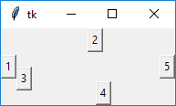

# Лекция 1. Графический интерфейс на Tkinter

Консольные программы мы уже писать умеем. Время познакомиться с **GUI** (Graphical User Interface) — пользовательскими интерфейсами с окнами, кнопками, полями ввода, меню.

Для Python есть несколько способов делать GUI:

| Библиотека | Особенности |
|------------|-------------|
| **Tkinter** | Встроенная в стандартную поставку Python обёртка над tcl/tk. Минимальный набор виджетов, кроссплатформенная. Идеально для первых упражнений и небольших утилит. |
| **PyQt6 / PySide6** | Привязки к C++ фреймворку Qt. Полноценная экосистема: визуальный дизайнер, темы, виджеты, мультимедиа, БД. Промышленный стандарт. |
| **CEF Python / pywebview** | Встроенный браузер на базе Chromium. Дизайн интерфейса на HTML/CSS/JS — удобно для информационных киосков и SaaS-десктопа. |
| **Kivy / Flet** | Современные кроссплатформенные UI (включая мобильные). |

Эту тему мы откроем с **Tkinter** — потому что он встроен в Python, и его достаточно, чтобы разобраться с базовыми понятиями: виджет, родитель, упаковщик, событие.

В мире Go устойчивых GUI-библиотек существенно меньше — самые живые проекты — **Fyne** и **gioui.org**; для desktop-приложений в Go-сообществе чаще выбирают **wails** (Chromium-обёртка) или **Electron** на Node.js — об этом подходе будет лекция 3.

## Что такое Tkinter

**Tkinter** (от *tk interface*) — это привязка Python к графическому инструментарию tcl/tk. Он:

- кроссплатформенный (Windows, macOS, Linux);
- идёт в стандартной поставке Python — ничего не нужно ставить отдельно;
- использует *event loop* — цикл обработки событий, в котором живут все виджеты.

> Начиная с Python 3 модуль называется `tkinter` (с маленькой буквы, по PEP 8). В более старых учебниках можно встретить `Tkinter` — это устаревшее имя.

Импортируется обычным способом:

```python
import tkinter as tk
from tkinter import ttk   # современные «тематические» виджеты
```

В Tkinter графические элементы называются **виджетами** (от англ. *window gadget*).

## Минимальное приложение

`Tk` — корневой класс приложения. При создании запускается интерпретатор tcl/tk и появляется главное окно.

```python
import tkinter as tk

root = tk.Tk()
root.title("Привет, Tkinter")
root.geometry("400x300")
root.mainloop()
```

`mainloop()` запускает цикл обработки событий. Пока он работает — окно отображается; следующие строки Python-кода не выполняются.

## Общее у всех виджетов

Виджеты создаются конструктором соответствующего класса. Первый аргумент (обычно неименованный) — **родительский** виджет. Если не указан — берётся главное окно.

```python
import tkinter as tk


def on_click() -> None:
    print("Клик!")


root = tk.Tk()
btn = tk.Button(root, text="Кликни меня", bg="red", command=on_click)
btn.pack()
root.mainloop()
```

Часто используемые параметры конструктора:

| Параметр | Что задаёт |
|----------|------------|
| `text` | Подпись на виджете. |
| `bg` / `background` | Цвет фона. |
| `fg` / `foreground` | Цвет текста. |
| `font` | Шрифт и размер. |
| `command` | Функция-обработчик активации (для кнопок и подобных). |
| `width`, `height` | Размер. |

### Изменение конфигурации после создания

```python
btn["text"] = "Новый текст"
btn.configure(bg="green", command=other_callback)
print(btn["bg"])              # cget через []
```

## Основные виджеты

| Виджет | Назначение |
|--------|------------|
| `tk.Toplevel` | Окно верхнего уровня (для многооконных приложений и диалогов). |
| `tk.Frame` | Контейнер для группировки других виджетов. |
| `tk.Label` | Статическая подпись. |
| `tk.Button` | Кнопка. |
| `tk.Entry` | Одна строка ввода. |
| `tk.Text` | Многострочный редактор. |
| `tk.Listbox` | Список с выбором одного или нескольких пунктов. |
| `tk.Checkbutton` | Флажок. |
| `tk.Radiobutton` | Радио-кнопка. |
| `tk.Scale` | Ползунок. |
| `tk.Scrollbar` | Полоса прокрутки. |

### Пример: окно с парой виджетов

```python
import tkinter as tk

root = tk.Tk()
root.title("Учебка")

tk.Label(root, text="Ваше имя:").pack(pady=4)

name_var = tk.StringVar(value="мир")
tk.Entry(root, textvariable=name_var).pack(pady=4)

def greet() -> None:
    tk.Label(root, text=f"Привет, {name_var.get()}!").pack()

tk.Button(root, text="Поприветствовать", command=greet).pack(pady=8)

root.mainloop()
```

`StringVar` (а ещё `IntVar`, `DoubleVar`, `BooleanVar`) — обёртки, к которым можно «привязывать» виджеты: изменили значение — автоматически обновляется виджет, и наоборот.

## Упаковщики (менеджеры геометрии)

Размещение виджетов в окне делается **менеджером геометрии**. В одном родительском виджете нельзя смешивать менеджеры — выберите один:

| Менеджер | Когда применять |
|----------|------------------|
| `pack` | Простые ряды/колонки; самый лаконичный, но наименее предсказуемый. |
| `grid` | Таблица из строк и столбцов — лучший выбор для большинства форм. |
| `place` | Абсолютные или относительные координаты. Полный контроль и полная ответственность. |

### `pack`

```python
btn1 = tk.Button(root, text="1");  btn1.pack(side="left")
btn2 = tk.Button(root, text="2");  btn2.pack(side="top")
btn3 = tk.Button(root, text="3");  btn3.pack(side="left")
btn4 = tk.Button(root, text="4");  btn4.pack(side="bottom")
btn5 = tk.Button(root, text="5");  btn5.pack(side="right")
```



Параметры:

- `side` — `"left"` / `"right"` / `"top"` / `"bottom"`;
- `fill` — `"x"` / `"y"` / `"both"` — расширять ли виджет вдоль оси;
- `expand` — `True` / `False` — занимать ли всё доступное пространство;
- `padx` / `pady` — внешние отступы.

### `grid`

```python
tk.Label(root, text="Имя:").grid(row=0, column=0, sticky="e")
tk.Entry(root).grid(row=0, column=1, sticky="ew")

tk.Label(root, text="Фамилия:").grid(row=1, column=0, sticky="e")
tk.Entry(root).grid(row=1, column=1, sticky="ew")

tk.Button(root, text="Сохранить").grid(row=2, column=0, columnspan=2, pady=8)

root.columnconfigure(1, weight=1)
```

Ключевые параметры:

- `row`, `column` — координаты ячейки.
- `rowspan`, `columnspan` — растягивание на несколько ячеек.
- `sticky` — направления, к которым «приклеивать» виджет (`n`, `s`, `e`, `w`, или их комбинация).
- `padx`, `pady` — внешние отступы.
- `columnconfigure(idx, weight=…)` / `rowconfigure` — как столбец/строка реагирует на изменение размеров окна.

`grid` гораздо удобнее для форм, чем `pack`.

### `place`

```python
btn.place(x=10, y=20)
btn.place(relx=0.5, rely=0.5, anchor="center")  # центр родителя
```

Применяется редко — обычно для всплывающих элементов и нестандартных интерфейсов.

## Привязка событий

### Через `command` у виджета

Самый простой способ — для кнопок, чекбоксов, скейлов:

```python
btn = tk.Button(root, command=on_click)
```

### Через `bind`

`bind` универсальнее — позволяет реагировать на любые события (нажатия клавиш, движения мыши, изменение размеров окна):

```python
def on_key(event):
    print("Нажата клавиша:", event.keysym)

root.bind("<Key>", on_key)
root.bind("<Button-1>", lambda e: print(f"клик в ({e.x},{e.y})"))
root.bind("<Control-q>", lambda e: root.quit())
```

В колбэк передаётся объект `Event` с атрибутами `x`, `y`, `keysym`, `widget`, `time` и т.д.

Типичные имена событий:

- `<Button-1>` / `<Button-2>` / `<Button-3>` — клик левой / средней / правой кнопкой мыши;
- `<Double-Button-1>` — двойной клик;
- `<KeyPress>`, `<KeyRelease>` — нажатие/отпускание клавиши;
- `<Motion>` — движение мыши;
- `<Configure>` — изменение размера/положения окна;
- `<Control-q>`, `<Alt-F4>` — комбинации с модификаторами.

## Таймеры и периодические задачи

В Tkinter нельзя писать `while True: ...` внутри `mainloop` — окно «зависнет». Для отложенных и периодических действий используют `after`:

```python
def tick() -> None:
    label["text"] = time.strftime("%H:%M:%S")
    label.after(1000, tick)  # перепланируем через 1 секунду

label = tk.Label(root, font="Helvetica 24")
label.pack()
label.after(0, tick)
```

`after(ms, fn)` ставит задачу в очередь событий — она выполнится после указанного интервала, **не блокируя UI**.

## Изображения

```python
img = tk.PhotoImage(file="logo.png")
tk.Label(root, image=img).pack()
```

Tkinter в стандартной поставке умеет PNG и GIF. Для JPEG/WebP/масштабирования — устанавливают `Pillow`:

```python
from PIL import Image, ImageTk

src = Image.open("photo.jpg").resize((200, 150))
img = ImageTk.PhotoImage(src)
tk.Label(root, image=img).pack()
```

> **Внимание:** Tkinter не удерживает ссылку на изображение сам — если переменная `img` уйдёт из области видимости, картинка пропадёт. Храните её как поле объекта или глобальную переменную.

## `ttk` — тематические виджеты

`tkinter.ttk` — расширение со «стилизованными» виджетами, которые лучше выглядят на современных ОС. Часть виджетов дублирует `tk` (`Button`, `Entry`, `Label`, `Frame`, `Checkbutton`, `Radiobutton`, `Scale`, `Scrollbar`), есть и новые: `Combobox`, `Notebook` (вкладки), `Progressbar`, `Treeview` (таблица/дерево), `Separator`, `Sizegrip`.

```python
from tkinter import ttk

combo = ttk.Combobox(root, values=["Один", "Два", "Три"])
combo.current(0)
combo.pack()

pb = ttk.Progressbar(root, length=200, mode="indeterminate")
pb.pack()
pb.start(50)
```

### Темы и стили

```python
from tkinter import ttk

style = ttk.Style()
print(style.theme_names())      # доступные темы
style.theme_use("clam")         # сменить тему

style.configure("Big.TButton", font=("Helvetica", 16), padding=10)
ttk.Button(root, text="Большая", style="Big.TButton").pack()
```

Когда есть выбор — используйте `ttk`. Внешний вид современнее, а API почти не отличается.

## Структура: ООП-подход

Маленькие приложения можно писать «процедурно», но как только виджетов становится больше десятка — заводят класс-наследник `tk.Tk` или `ttk.Frame`:

```python
import tkinter as tk
from tkinter import ttk


class App(tk.Tk):
    def __init__(self) -> None:
        super().__init__()
        self.title("Учебка")
        self.geometry("400x200")
        self._build()

    def _build(self) -> None:
        self.name = tk.StringVar(value="мир")

        ttk.Label(self, text="Имя:").grid(row=0, column=0, sticky="e", padx=4, pady=4)
        ttk.Entry(self, textvariable=self.name).grid(row=0, column=1, sticky="ew", padx=4, pady=4)
        ttk.Button(self, text="Привет!", command=self._greet).grid(row=1, column=0, columnspan=2, pady=8)

        self.result = ttk.Label(self, font=("Helvetica", 14))
        self.result.grid(row=2, column=0, columnspan=2)

        self.columnconfigure(1, weight=1)

    def _greet(self) -> None:
        self.result.config(text=f"Привет, {self.name.get()}!")


if __name__ == "__main__":
    App().mainloop()
```

## Сравнение с Go (Fyne)

Чтобы почувствовать аналогию — тот же «Hello» на [Fyne](https://fyne.io/):

```go
package main

import (
    "fyne.io/fyne/v2/app"
    "fyne.io/fyne/v2/container"
    "fyne.io/fyne/v2/widget"
)

func main() {
    a := app.New()
    w := a.NewWindow("Учебка")

    nameEntry := widget.NewEntry()
    nameEntry.SetText("мир")

    result := widget.NewLabel("")

    greet := widget.NewButton("Привет!", func() {
        result.SetText("Привет, " + nameEntry.Text + "!")
    })

    w.SetContent(container.NewVBox(
        widget.NewLabel("Имя:"),
        nameEntry,
        greet,
        result,
    ))
    w.ShowAndRun()
}
```

Идея та же: виджеты, контейнеры, обработчики событий, `ShowAndRun` ≈ `mainloop`.

## Сравнение Python ↔ Go

| Аспект | Python (Tkinter) | Go (Fyne) |
|--------|------------------|-----------|
| В стандартной библиотеке | да | нет (`go get fyne.io/fyne/v2`) |
| Цикл событий | `root.mainloop()` | `app.Run()` / `window.ShowAndRun()` |
| Менеджеры расположения | `pack`, `grid`, `place` | контейнеры (`VBox`, `HBox`, `GridLayout`, ...) |
| Темы | `ttk.Style` | встроенная Light/Dark, кастомизируется через `Theme` |
| Привязка данных | `StringVar`/`IntVar` | `binding.NewString()` |
| Визуальный редактор | нет (но Tkinter Designer для Figma) | нет |

## Когда Tkinter — лучший выбор

- Учебные задачи и прототипы.
- Маленькие утилиты «под себя».
- Когда нельзя ставить зависимости.

Когда уже **не лучший** — следующая лекция: для реального десктопного приложения берут **PyQt6**.

---

## Контрольные вопросы

- Что такое event loop в Tkinter и почему в нём нельзя писать `while True`?
- В чём разница между `tk.Tk()` и `tk.Toplevel()`?
- Зачем нужны переменные-обёртки `StringVar`, `IntVar`?
- Когда применять `pack`, когда `grid`, а когда `place`?
- Что такое `sticky` у `grid` и зачем нужны `columnconfigure(... weight=...)`?
- Чем `command` отличается от `bind`?
- Как сделать периодическую задачу без блокировки UI?
- Почему изображение пропадает, если переменная с `PhotoImage` выходит из области видимости?
- Чем `ttk` отличается от обычного `tk` и почему для новых проектов берут `ttk`?
- Какие аналоги Tkinter существуют в Go и в чём их главные ограничения?
