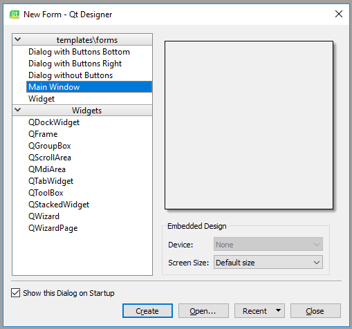
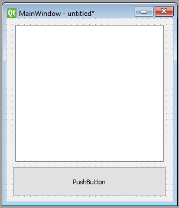
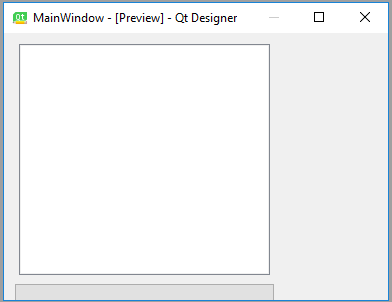
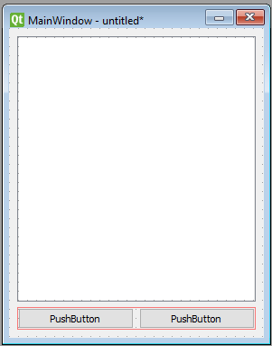
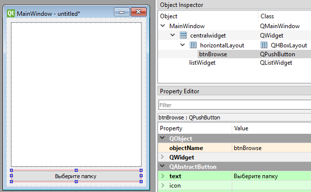

# Лекция 2. GUI на PyQt и Qt Designer

Tkinter — простой, но ограниченный: устаревший внешний вид, скромный набор виджетов, отсутствие визуального дизайнера. Для серьёзных десктопных приложений в мире Python берут **PyQt** или **PySide** — привязки к C++-фреймворку **Qt**.

Что входит в Qt:

- набор виджетов и стилей оформления (под все основные ОС);
- работа с базами данных через SQL (ODBC, MySQL, PostgreSQL, Oracle, SQLite);
- работа с XML, JSON, регулярными выражениями;
- мультимедиа (видео, аудио);
- WebEngine (встроенный браузер на Chromium);
- мощная система сигналов и слотов для обработки событий;
- интернационализация (i18n);
- **Qt Designer** — визуальный редактор окон.

Параллельно существуют **PyQt6** (от Riverbank Computing, GPL/коммерческая) и **PySide6** (официальная от Qt Company, LGPL). API почти полностью совпадает — выбирают чаще PySide6 ради LGPL-лицензии.

```bash
# PyQt6
uv add PyQt6

# либо PySide6
uv add PySide6
```

В лекции примеры на PyQt6 — для PySide6 достаточно заменить `from PyQt6...` на `from PySide6...`.

## Минимальное окно вручную

Окно можно «нарисовать» прямо в коде, как и в Tkinter:

```python
import sys
from PyQt6.QtWidgets import QApplication, QWidget

app = QApplication(sys.argv)

w = QWidget()
w.resize(250, 150)
w.move(300, 300)
w.setWindowTitle("Простое окно")
w.show()

sys.exit(app.exec())
```

Структура любой PyQt-программы:

1. `QApplication(sys.argv)` — единственный экземпляр на программу, управляет циклом событий и платформенными штуками.
2. Создаём окна и виджеты.
3. `app.exec()` — запускаем цикл событий (в Tkinter эту роль играет `mainloop()`).

Для маленьких форм код в стиле «всё руками» приемлем. Но как только виджетов становится больше десятка — нужен дизайнер.

## Qt Designer

**Qt Designer** — визуальный редактор `.ui`-файлов (XML с описанием окна). Поставляется отдельно:

```bash
# Через uv добавим инструменты, в которых лежит designer
uv add pyqt6-tools
# либо для PySide6 — designer идёт сразу в коробке
uv add pyside6
```

После установки Qt Designer запускается командой `pyqt6-tools designer` (или `pyside6-designer`).

### Создание формы

При запуске Qt Designer показывает диалог новой формы — выбираем **Main Window** и нажимаем **Create**:



Появляется заготовка главного окна. Слева — палитра виджетов (**Widget Box**), справа — иерархия объектов (**Object Inspector**) и редактор свойств (**Property Editor**).

Если меню и строка состояния не нужны — удалите их через **Object Inspector** (правый клик → **Remove**).

### Добавляем виджеты

Перетащите на форму, например, **List Widget** (не List View) и **Push Button**:



Нажмите **Form → Preview** — увидите окно с расставленными элементами. Но что произойдёт при изменении размера окна?



Виджеты остались на своих абсолютных позициях, не следуя за окном. Чтобы UI был «резиновым», используют **layouts** (макеты).

### Layouts

Макет — это контейнер, удерживающий виджеты в нужной геометрии при изменении размера окна. Самые ходовые:

- **Vertical Layout** — друг под другом;
- **Horizontal Layout** — в ряд;
- **Grid Layout** — таблица;
- **Form Layout** — пары «подпись : поле ввода».

Кликните правой кнопкой по **Main Window** в Object Inspector → **Lay Out → Lay Out Vertically**. Теперь добавленные виджеты раскладываются по вертикали и тянутся вместе с окном.

Макеты можно вкладывать друг в друга. Например, горизонтальный с двумя кнопками внутри вертикального:



### Имена и свойства

В **Property Editor** меняйте `objectName` каждого виджета на осмысленное имя — именно по нему вы будете обращаться к нему из кода.

Хорошая практика: давать кнопкам префикс `btn`, полям ввода — `le` (line edit), спискам — `lw` (list widget). Это «венгерская нотация» — она помогает быстро понимать тип:



Например:

- `btnBrowse` — кнопка «Открыть папку»;
- `listWidget` — список содержимого.

Сохраните форму как `design.ui` в каталоге проекта. Это обычный XML-файл, который можно как использовать напрямую, так и сконвертировать в Python-код.

## Превращаем `.ui` в Python: `pyuic6`

Утилита `pyuic6` генерирует `design.py` из `design.ui`:

```bash
pyuic6 design.ui -o design.py
```

В `design.py` появится класс `Ui_MainWindow` с методом `setupUi(self, MainWindow)`, который собирает виджеты на форме.

> Сгенерированный файл **никогда не редактируйте руками** — он перезатирается при каждой регенерации.

## Логика приложения

Создаём отдельный `main.py`, в котором наследуемся от `QMainWindow` *и* от сгенерированного класса формы:

```python
import sys
from PyQt6 import QtWidgets

from design import Ui_MainWindow


class ExampleApp(QtWidgets.QMainWindow, Ui_MainWindow):
    def __init__(self) -> None:
        super().__init__()
        self.setupUi(self)


if __name__ == "__main__":
    app = QtWidgets.QApplication(sys.argv)
    window = ExampleApp()
    window.show()
    sys.exit(app.exec())
```

Запускаете — окно показывается, но кнопка ничего не делает. Привяжем обработчик.

## Сигналы и слоты

Главная идея Qt — **сигналы и слоты**. У каждого виджета есть сигналы (например, у кнопки `clicked`, у поля ввода `textChanged`), к которым можно подключить **слот** — обычную функцию или метод.

```python
self.btnBrowse.clicked.connect(self.browse_folder)
```

- `self.btnBrowse` — объект кнопки (имя задано в Qt Designer);
- `clicked` — сигнал «по кнопке кликнули»;
- `connect(...)` — подключение слота;
- `self.browse_folder` — метод, который выполнится при клике.

### Полный пример: показать содержимое папки

```python
import os
import sys

from PyQt6 import QtWidgets

from design import Ui_MainWindow


class ExampleApp(QtWidgets.QMainWindow, Ui_MainWindow):
    def __init__(self) -> None:
        super().__init__()
        self.setupUi(self)
        self.btnBrowse.clicked.connect(self.browse_folder)

    def browse_folder(self) -> None:
        self.listWidget.clear()

        directory = QtWidgets.QFileDialog.getExistingDirectory(self, "Выберите папку")
        if not directory:
            return

        for file_name in sorted(os.listdir(directory)):
            self.listWidget.addItem(file_name)


if __name__ == "__main__":
    app = QtWidgets.QApplication(sys.argv)
    ExampleApp().show()
    sys.exit(app.exec())
```

`QFileDialog.getExistingDirectory(...)` показывает стандартный системный диалог выбора каталога и возвращает абсолютный путь либо пустую строку, если пользователь нажал «Отмена».

## Перехват закрытия окна

Иногда нужно спросить пользователя перед закрытием — переопределяем виртуальный метод `closeEvent`:

```python
from PyQt6.QtWidgets import QMessageBox


def closeEvent(self, event) -> None:
    reply = QMessageBox.question(
        self,
        "Подтверждение",
        "Точно закрыть программу?",
        QMessageBox.StandardButton.Yes | QMessageBox.StandardButton.No,
        QMessageBox.StandardButton.No,
    )
    if reply == QMessageBox.StandardButton.Yes:
        event.accept()
    else:
        event.ignore()
```

## Прямая загрузка `.ui` без `pyuic6`

Можно вообще не генерировать `design.py`, а грузить `.ui` в рантайме:

```python
from PyQt6 import QtWidgets, uic


class ExampleApp(QtWidgets.QMainWindow):
    def __init__(self) -> None:
        super().__init__()
        uic.loadUi("design.ui", self)
        self.btnBrowse.clicked.connect(self.browse_folder)

    def browse_folder(self) -> None:
        ...
```

Плюсы: быстрая итерация дизайна (не нужно регенерировать `.py`).
Минусы: IDE не подсказывает атрибуты виджетов (нет статически известного класса).

## Структура реального проекта

Типичный layout:

```
my-app/
├── pyproject.toml
├── src/
│   └── my_app/
│       ├── __init__.py
│       ├── __main__.py        # точка входа: python -m my_app
│       ├── main_window.py     # класс окна + логика
│       ├── design.ui          # форма для Qt Designer
│       └── resources/         # картинки, иконки
└── tests/
```

В `pyproject.toml` — entry point:

```toml
[project.scripts]
my-app = "my_app.__main__:main"
```

## Дополнительные возможности Qt, на которые стоит обратить внимание

- **`QSettings`** — кроссплатформенное хранение настроек (реестр на Windows, plist на macOS, conf-файл на Linux).
- **`QThread` / `QtConcurrent`** — фоновая работа без подвисания UI.
- **`QStandardItemModel` + `QTableView` / `QTreeView`** — таблицы и деревья на модели данных.
- **`QSqlDatabase`** — встроенные драйверы СУБД.
- **Style Sheets (QSS)** — CSS-подобная стилизация всего интерфейса.
- **`QtCharts`** — графики (в LGPL-сборке Qt6 идёт в коробке).
- **i18n через `tr(...)` + Qt Linguist** — перевод приложения.

## Сравнение Python ↔ Go

В Go-экосистеме прямого аналога Qt нет. Самые близкие варианты:

- **`go-qt6` / `therecipe/qt`** — биндинги к Qt, но они менее живы и сложны в сборке;
- **`Fyne`** — самостоятельный нативный GUI на Go, проще, но беднее по виджетам;
- **`wails`** — про неё в следующей лекции.

Концептуально Qt сравнить с Fyne можно так:

| Аспект | PyQt6 / PySide6 | Fyne |
|--------|-----------------|------|
| Визуальный редактор | Qt Designer (`.ui` файлы) | Нет (всё в коде) |
| События | Сигналы и слоты (`signal.connect(slot)`) | Колбэки в `OnTapped`, `OnChanged` |
| Layouts | `QVBoxLayout`, `QHBoxLayout`, `QGridLayout`, `QFormLayout` | `container.NewVBox`, `NewHBox`, `NewGridWithColumns` |
| Стили | Qt Style Sheets (QSS) | Темы (`Theme` интерфейс) |
| Многопоточность | `QThread`, `QtConcurrent` | Горутины (естественно) |
| Виджеты | Около 50 стандартных + чарты, веб, мультимедиа | Меньше, но всё необходимое |
| Лицензия | GPL/коммерческая (PyQt6), LGPL (PySide6) | BSD-3 |

## Когда брать PyQt/PySide

- Полноценное десктопное приложение для пользователей.
- Нужны таблицы, деревья, графики, мультимедиа.
- Требуется визуальный дизайнер для нетехнических участников команды.
- Сложные пользовательские сценарии: drag&drop, контекстные меню, кастомные виджеты.

Когда — **не лучший** выбор:

- Прототип «на час» — берите Tkinter.
- Web-app в обёртке — следующая лекция.
- Мобильное приложение — Kivy / Flutter / нативные стеки.

---

## Контрольные вопросы

- В чём разница между PyQt6 и PySide6 — практически и юридически?
- Зачем нужен `QApplication` и почему он должен быть единственный?
- Что такое сигналы и слоты и в чём их преимущество перед обычными колбэками?
- Что хранится в `.ui`-файле и какие два способа его использования есть?
- Когда стоит использовать `pyuic6`, а когда `uic.loadUi`?
- Зачем layouts и в чём проблема «приложения без layout»?
- Что такое venгерская нотация и почему она остаётся полезной в Qt Designer?
- Как организовать долгую фоновую задачу без зависания интерфейса в PyQt?
- Какие альтернативы PyQt существуют в мире Go и в чём их главные ограничения?
